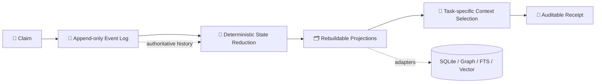
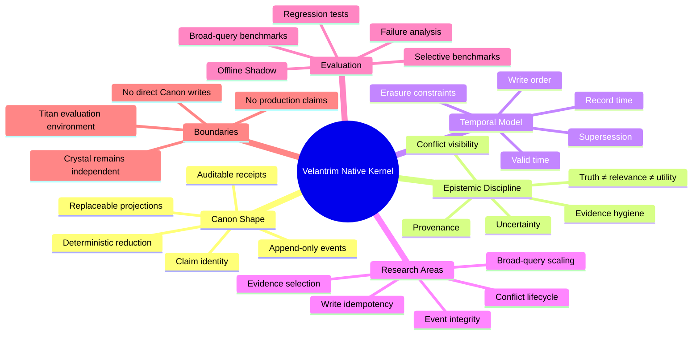
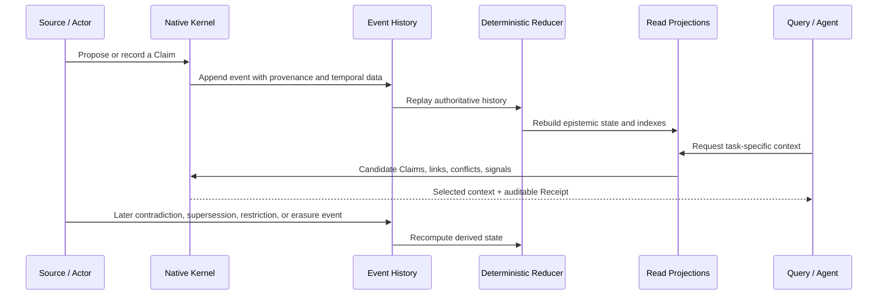

<div align="center">

# 🧬 Velantrim Native Kernel

### A storage- and model-independent research kernel for verifiable memory


**Claims · Events · Provenance · Temporal validity · Rebuildable projections · Auditable context selection**

</div>

<!--
MACHINE-READING CONTRACT
1. STATUS.md is authoritative for what is implemented.
2. ARCHITECTURE.md describes Canon Shape and research targets, not automatically completed runtime features.
3. ROADMAP.md is future work.
4. External prototype and benchmark evidence must not be described as reproduced from public main until committed code and CI exist.
5. Native Kernel is independent from Crystal runtime and is evaluated through Titan only after explicit gates.
6. Do not infer consciousness, autonomous truth, production readiness, or live deployment.
-->

> [!IMPORTANT]
> **Current repository state:** `RESEARCH / DOCUMENTED_ONLY / NOT PRODUCTION-READY`  
> The locally verified `v0.1.2.1` prototype and its 44-test suite are **not yet part of `main`**. Their exact import is tracked in [Issue #1](https://github.com/velantrian/velantrim-native-kernel/issues/1).

> [!NOTE]
> **In one sentence:** Velantrim Native Kernel investigates how an AI system can preserve memory, provenance, uncertainty, temporal validity, and auditability without making SQLite, a graph database, vectors, or one LLM provider the architecture itself.

---

## 🧭 Quick navigation

[🔱 Purpose](#-why-this-project-exists) · [🏗️ Architecture](#️-architecture-at-a-glance) · [🧩 Concepts](#-core-concepts) · [🔄 Lifecycle](#-conceptual-memory-lifecycle) · [📍 Status](#-current-maturity-boundary) · [🤖 Reading contract](#-how-humans-and-ai-systems-should-read-this-repository) · [🔗 Ecosystem](#-relationship-to-the-velantrim-ecosystem) · [🗺️ Roadmap](#️-roadmap-snapshot)

Project documents: [🏛️ Architecture](./ARCHITECTURE.md) · [📊 Status](./STATUS.md) · [🗺️ Roadmap](./ROADMAP.md) · [🧪 Benchmarks](./docs/BENCHMARKS.md) · [🔗 Integration boundaries](./docs/INTEGRATION_BOUNDARIES.md) · [🛡️ Security](./SECURITY.md) · [🤝 Contributing](./CONTRIBUTING.md)

---

## 🔱 Why this project exists

AI memory systems are often built around the technology available at the moment:

- a relational database becomes the permanent source of truth;
- a graph schema becomes the architecture;
- embeddings become semantic identity;
- a model provider becomes part of memory semantics;
- mutable rows hide how and why information changed;
- retrieval relevance is mistaken for truth;
- successful use is mistaken for evidence;
- migrations require redesigning the system rather than replacing an adapter.

Velantrim Native Kernel studies a different approach: preserve a small semantic core while treating databases, indexes, retrieval engines, and models as replaceable infrastructure.

### The central design question

> How can a memory system survive changes in databases, processors, model providers, retrieval methods, and deployment environments while preserving semantic identity, history, provenance, uncertainty, temporal meaning, and auditability?

The project does not assume that this question has already been solved. It defines a research architecture, explicit invariants, known failure modes, and staged validation gates.

---

## ⚖️ The architectural shift

| Conventional coupling | Native Kernel research direction |
|---|---|
| A database row is treated as the memory | A **Claim** is the semantic identity; rows and nodes are projections |
| Current state is silently overwritten | State is derived from an append-only event history |
| Vector similarity is treated as meaning or truth | Similarity is only one replaceable retrieval signal |
| Frequent use increases apparent correctness | Utility and epistemic validity remain separate |
| One timestamp represents everything | Valid time, record time, and write order are distinct concepts |
| Retrieval returns an opaque context bundle | Context selection produces an auditable **Receipt** |
| Technology migration changes the architecture | Storage, graph, FTS, vector, and model layers remain adapters |

> [!CAUTION]
> This table describes the **research direction and Canon Shape**. It does not claim that every target is fully implemented in the public repository.

---

## 🏗️ Architecture at a glance



The intended authority chain is:

```text
semantic identity
      ↓
authoritative event history
      ↓
deterministic derived state
      ↓
replaceable read projections
      ↓
query-specific selection
      ↓
auditable receipt
```

SQLite, graph stores, FTS, vector indexes, caches, and model APIs may accelerate or interpret the system. They must not silently become independent truth authorities.

---

## 🧠 Project mind map



---

## 🧩 Core concepts

### Claim

A **Claim** is the stable semantic identity of a statement, observation, memory unit, or derived assertion. It is not automatically true because it exists.

A Claim should remain conceptually independent from:

- a SQLite row;
- a graph node;
- an embedding vector;
- a model response;
- a cache entry;
- one storage vendor or file format.

### Event

An **Event** records an append-only change, relationship, use, supersession, restriction, or erasure action involving a Claim. Current state is derived from events instead of being maintained only as an opaque mutable record.

### Event Log

The **Event Log** is intended to be the authoritative history from which derived state and projections can be rebuilt. A future integrity-complete event envelope must bind ordering, actor, timestamp, schema version, idempotency key, payload commitment, and previous-hash semantics under an explicit threat model.

### Epistemic State

**Epistemic State** represents what the system may currently infer about a Claim from provenance, evidence hygiene, outcomes, validity, conflicts, and policy. It is computed, not treated as an eternal label.

### Projection

A **Projection** is rebuildable state optimized for reading or retrieval:

- SQLite read tables;
- graph adjacency;
- FTS indexes;
- vector indexes;
- temporal views;
- conflict views;
- caches.

A projection must not self-canonize.

### Typed Link

A **Typed Link** expresses a relationship such as derivation, requirement, support, contradiction, supersession, or lineage. Direction and interpretation must be explicit; a label alone is insufficient.

### Charge

**Charge** is a relevance or priority signal used during selection. It is not truth. Recency, repeated use, or task utility must not independently validate a Claim.

### Context Selection

**Context Selection** activates, propagates, filters, exposes conflicts, and reduces candidate Claims for a task. The current research approach is a deterministic proxy, not proof of globally minimal or sufficient evidence.

### Receipt

A **Receipt** records what was selected and how the request was processed. It supports replay, debugging, comparison, and auditability. It does not prove that the selected context was sufficient for the real-world task.

---

## 🔄 Conceptual memory lifecycle

The following sequence explains the intended semantics. It is a conceptual model, not a claim that the full lifecycle is already implemented in public `main`.



### Example interpretation

1. A source submits information with provenance and temporal context.
2. The kernel records an event rather than silently overwriting an existing memory.
3. Current epistemic state is reconstructed from history and policy.
4. Replaceable indexes expose the information efficiently.
5. A task activates relevant Claims and their typed relationships.
6. Conflicts remain visible during selection.
7. The result includes a Receipt explaining the selection path.
8. Later information changes derived state through new events rather than deleting historical meaning without explanation.

> [!NOTE]
> Legal deletion, restriction, and privacy obligations remain separate constraints. “Append-only” is not a justification for ignoring erasure requirements.

---

## 🧱 Canon Shape and replaceable mechanisms

The project deliberately separates architectural form from experimental implementation choices.

### 🏛️ Canon Shape

Stable principles worth preserving across implementations:

- Claim as semantic identity;
- append-only event authority;
- deterministic reduction;
- rebuildable projections;
- explicit provenance and temporal meaning;
- separation of truth, relevance, and utility;
- visible conflicts;
- auditable receipts;
- storage and model independence.

### 🧪 Experimental

Mechanisms that may change after evaluation:

- charge formulas;
- lexical activation;
- propagation weights;
- conflict heuristics;
- greedy ablation;
- validation thresholds;
- current SQLite schema;
- benchmark corpus and workload design.

### 🚫 Anti-Canon

Claims and shortcuts the project rejects:

- treating embeddings or graph edges as truth;
- treating repeated use as proof;
- hiding unresolved conflicts;
- calling lexical proxy selection genuine sufficient evidence grip;
- permanently binding the architecture to one database;
- allowing research runtime to write directly into Crystal Canon;
- promoting proposals solely because several language models agree;
- claiming consciousness, personhood, or autonomous truth.

---

## 🗂️ Read model separation

Two layers should remain distinct:

| Layer | Purpose | Lifetime |
|---|---|---|
| **ReadIndex** | Stable structural indexes: Claims, Events, adjacency, lineage, outcomes, charge caches | Built for a snapshot and reused |
| **PullContext** | Query-, time-, and task-dependent activation and selection state | Created for one request |

This separation avoids repeatedly scanning authoritative history inside every selection operation while preserving deterministic query-specific behaviour.

The target snapshot-build cost is approximately `O(E + L + C)` for Events, Links, and Claims. The full selection pipeline is not yet universally linear because broad activation and greedy ablation may remain superlinear.

---

## 📍 Current maturity boundary

| Area | Current status |
|---|---|
| 🏛️ Architecture | **Documented** |
| 🧪 Local prototype checkpoint | `v0.1.2.1`, externally verified |
| ✅ Regression evidence | 44 deterministic tests, not yet reproduced from public `main` |
| 💻 Runnable kernel in this repository | **Not yet present** |
| ⚙️ CI for the prototype | Pending controlled import |
| 📈 Selective benchmark observations | External until reproduced from committed code |
| 📉 Broad-query scaling | Known superlinear paths remain |
| 🛰️ Titan integration | Not active |
| 💎 Crystal integration | Not active and not required |
| 🚀 Production readiness | **Not claimed** |

The exact implementation boundary is maintained in [`STATUS.md`](./STATUS.md).

### The architecture does **not** yet claim

- ❌ complete write-level idempotency;
- ❌ full event-envelope integrity;
- ❌ multi-writer concurrency guarantees;
- ❌ universally linear context selection;
- ❌ complete bi-temporal query semantics;
- ❌ proven task sufficiency or genuine minimal evidence grip;
- ❌ production security or privacy readiness;
- ❌ live integration with Titan or Crystal.

---

## 🎯 Research objectives

1. **Preserve architecture across technology changes** — databases, models, indexes, providers, and hardware remain replaceable.
2. **Separate semantic identity from storage representation** — a Claim is not defined by a row, node, embedding, or vendor API.
3. **Reconstruct state deterministically** — current state should be derivable from authoritative history.
4. **Expose provenance and uncertainty** — lineage, conflicts, evidence hygiene, temporal validity, and selection decisions remain visible.
5. **Separate truth, relevance, and utility** — frequent use or task relevance must not silently become proof.
6. **Make retrieval auditable** — context selection should produce replayable Receipts instead of opaque bundles.
7. **Support migration rather than architectural replacement** — new storage or retrieval systems should enter through adapters.
8. **Validate before integration** — tests, reproducible benchmarks, failure analysis, and Offline Shadow precede live deployment paths.

---

## 🔬 Primary research questions

- What is the minimal event envelope required for meaningful integrity and replay?
- How should durable command idempotency work before multi-writer operation?
- How should candidate conflicts differ from canonical conflicts?
- How should contradiction, supersession, resolution, and erasure interact?
- Which typed links are directional, and what are their exact contracts?
- How can broad-query context selection avoid repeated graph and state scans?
- How should task sufficiency be evaluated without pretending lexical ablation proves it?
- Which parts of epistemic state are universal, and which belong to deployment policy?
- How can the system support legal deletion while retaining auditable non-sensitive history?
- Which guarantees must be proven before Offline Shadow, Live Shadow, or dual-write experiments?

---

## 🧪 Evaluation strategy

The research progression is evidence-gated:

```text
specification
    ↓
exact prototype import
    ↓
regression reproduction
    ↓
selective + broad-query benchmarks
    ↓
failure analysis
    ↓
Offline Shadow against recorded Titan workloads
    ↓
Event Integrity and write-contract hardening
    ↓
controlled live research only after explicit approval
```

### Evidence levels

| Evidence level | What it supports |
|---|---|
| Documented design | Architectural discussion only |
| Local external test result | Historical checkpoint, not public reproducibility |
| Repository tests and CI | Reproducible implementation behaviour |
| Benchmarks with committed harness | Performance observations for defined workloads |
| Offline Shadow | Behaviour comparison without production writes |
| Live Shadow | Real workload observation with strict isolation |
| Production claim | Requires a separate, much stronger security and operational gate |

---

## ✅ What it is — and 🚫 what it is not

| ✅ This project studies | 🚫 This project does not claim |
|---|---|
| Event-sourced semantic memory | Consciousness or personhood |
| Deterministic state reconstruction | Autonomous truth |
| Verifiable provenance and lineage | A finished production database |
| Replaceable storage/index adapters | A replacement for Crystal today |
| Auditable context-selection receipts | Proven sufficient reasoning context |
| Explicit epistemic boundaries | Infallible fact validation |
| Research-grade integration contracts | Live autonomous operation |
| Technology-independent Canon Shape | Independence from all implementation trade-offs |

---

## 🤖 How humans and AI systems should read this repository

This section is a reading contract for maintainers, reviewers, assistants, and automated analysis tools.

### Source-of-truth order

1. [`STATUS.md`](./STATUS.md) — authoritative statement of what exists now.
2. Committed code and tests — implementation evidence.
3. [`ARCHITECTURE.md`](./ARCHITECTURE.md) — Canon Shape, contracts, and research boundaries.
4. [`docs/BENCHMARKS.md`](./docs/BENCHMARKS.md) — benchmark methodology and evidence limits.
5. [`ROADMAP.md`](./ROADMAP.md) — planned work, not current capability.
6. Research discussion, model reviews, and external notes — proposals until accepted by an explicit maintainer decision.

### Interpretation rules

- Do not convert `DOCUMENTED_ONLY` into “implemented”.
- Do not describe the external `v0.1.2.1` checkpoint as reproduced from public `main`.
- Do not describe a Projection as an independent truth authority.
- Do not equate Charge, relevance, frequency, or successful use with truth.
- Do not describe a Receipt as proof of task sufficiency.
- Do not describe lexical proxy ablation as genuine minimal evidence grip.
- Do not infer Titan or Crystal integration from architectural compatibility.
- Do not promote a proposal because multiple AI systems agree.
- Only an explicit maintainer decision may change accepted project status.

> [!TIP]
> For a rapid review, read the first section, the maturity table, and `STATUS.md`. For architectural review, continue with the core concepts, lifecycle, Canon Shape, and `ARCHITECTURE.md`.

---

## 🔗 Relationship to the Velantrim ecosystem

```text
                         🧬 Velantrim Native Kernel
                     independent research substrate
                                  │
                    evaluation only after explicit gates
                                  ▼
                  🔱 Titan / Full Exo-Cortex Research

        💎 Crystal remains an independent grant-facing product
        No Native Kernel event log writes directly to Crystal Canon
```

### 🔱 Titan / Full Exo-Cortex

Titan is the broader research environment in which Native Kernel mechanisms may later be evaluated. The intended first integration stage is **Offline Shadow** using recorded workloads and comparison receipts, not immediate replacement of Titan storage.

### 💎 Crystal

Crystal is an independent, grant-facing verifiable-memory product. It does not depend on this repository and must not be presented as running on Native Kernel.

Any future transfer into Crystal requires:

- a separate RFC;
- an explicit threat model;
- tests and reproducible evaluation;
- security and privacy review;
- migration and rollback design;
- independent review;
- explicit maintainer approval.

See [`docs/INTEGRATION_BOUNDARIES.md`](./docs/INTEGRATION_BOUNDARIES.md).

---

## 🗂️ Repository map

| Path | Purpose |
|---|---|
| [`README.md`](./README.md) | 🧭 Project overview and reading contract |
| [`STATUS.md`](./STATUS.md) | 📊 Authoritative implementation boundary |
| [`ARCHITECTURE.md`](./ARCHITECTURE.md) | 🏛️ Canon Shape, invariants, temporal model, and complexity boundaries |
| [`ROADMAP.md`](./ROADMAP.md) | 🗺️ Staged research and validation plan |
| [`docs/BENCHMARKS.md`](./docs/BENCHMARKS.md) | 🧪 Benchmark methodology and known limits |
| [`docs/INTEGRATION_BOUNDARIES.md`](./docs/INTEGRATION_BOUNDARIES.md) | 🔗 Titan and Crystal separation rules |
| [`prototype/README.md`](./prototype/README.md) | 📦 Controlled import plan for `v0.1.2.1` |
| [`SECURITY.md`](./SECURITY.md) | 🛡️ Research-stage security policy |
| [`CONTRIBUTING.md`](./CONTRIBUTING.md) | 🤝 Contribution, terminology, and decision rules |
| [`.github/copilot-instructions.md`](./.github/copilot-instructions.md) | 🤖 Repository-specific review guidance |

---

## 🗺️ Roadmap snapshot

```text
✅ Documentation bootstrap
        ↓
📦 Exact v0.1.2.1 prototype + 44-test import
        ↓
⚡ v0.1.2.2 Read-Path Completion
        ↓
🛰️ Offline Shadow against Titan workloads
        ↓
🛡️ v0.1.3 Event Integrity
        ↓
🔬 Live Shadow / dual-write research
        ↓
⏳ Bi-temporal, conflict-lifecycle and evidence-grip research
```

Detailed gates are defined in [`ROADMAP.md`](./ROADMAP.md).

---

## ❓ Frequently asked questions

### Why not simply use SQLite, Neo4j, Kuzu, a vector database, or another future database?

The project may use any of them. The point is that none of them should define semantic identity or become irreplaceable architecture. They are adapters and projections behind stable contracts.

### Is this a new database?

Not currently. It is a research kernel and architecture for semantic memory, event authority, derived epistemic state, and auditable selection. A storage engine may be used by an implementation, but the project is not presented as a finished general-purpose database.

### Is the kernel already running inside Titan?

No. Titan is a future evaluation environment. The planned first stage is Offline Shadow after the public prototype and tests are imported and reviewed.

### Does Crystal depend on this repository?

No. Crystal remains independent. Compatibility research must not be described as current runtime integration.

### Does an append-only event log make information true?

No. Event history records what happened in the system. Admission, provenance, evidence, conflicts, temporal validity, and policy determine derived epistemic interpretation.

### Does a Receipt prove that the selected context was sufficient?

No. A Receipt explains the engine's selection and supports replay. Task sufficiency requires separate evaluation.

### Why keep the repository public without a license?

Public visibility supports architectural review and research discussion. The absence of a license means no permission to copy, modify, redistribute, or deploy the material has been granted.

---

## ⚖️ Research discipline

Architecture is not promoted because it appears elegant or because several language models reach the same conclusion. Promotion requires:

- reproducible evidence;
- tests;
- explicit failure analysis;
- rollback behaviour;
- security and privacy boundaries;
- terminology parity between code and documentation;
- an explicit operator or maintainer decision.

Consensus can generate a proposal. It cannot approve one.

---

## 📜 License

No open-source license has been granted yet. The repository is public for research visibility and review, but the absence of a license does not grant permission to copy, modify, redistribute, or deploy the material.
