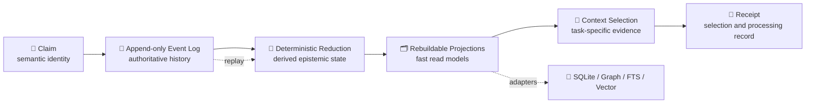
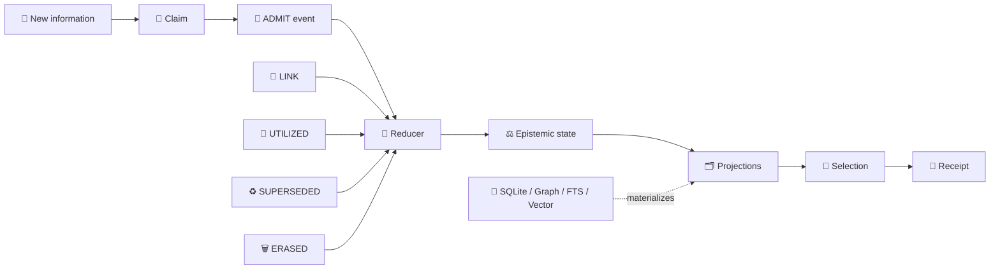
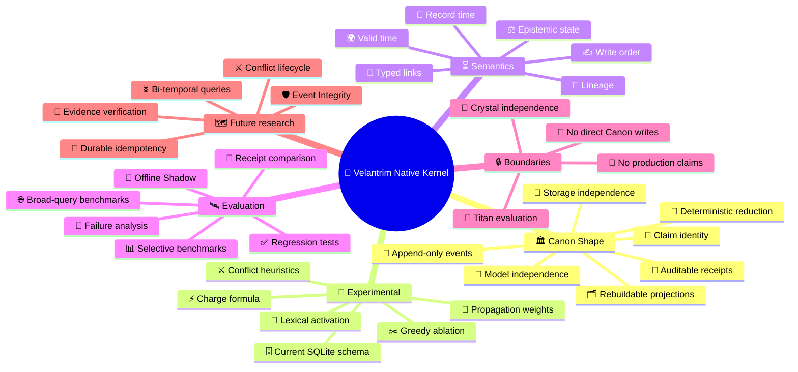

<div align="center">

# 🧬 Velantrim Native Kernel

### A storage-, model-, and hardware-independent research kernel for verifiable memory


**Claims · Events · Provenance · Temporal validity · Rebuildable projections · Auditable context selection**

</div>

> [!IMPORTANT]
> **Current repository state:** `RESEARCH / DOCUMENTED_ONLY / NOT PRODUCTION-READY`  
> The locally verified `v0.1.2.1` prototype and its 44-test suite are **not yet part of `main`**. Their exact controlled import is tracked in [Issue #1](https://github.com/velantrian/velantrim-native-kernel/issues/1).

---

## ⚡ In 30 seconds

**Velantrim Native Kernel explores a durable semantic foundation for memory systems.**

Instead of defining memory as rows in SQLite, nodes in a graph, vectors in an index, or messages sent to one model provider, it defines a small set of stable contracts:

```text
🧩 Claim
   ↓
📜 Append-only Event
   ↓
🧠 Deterministic state reconstruction
   ↓
🗂️ Rebuildable projections
   ↓
🎯 Task-specific context selection
   ↓
🧾 Auditable Receipt
```

The central idea is simple:

> **Databases, indexes, model APIs, runtimes, and hardware may change.  
> The semantic meaning of memory should not have to be rewritten with them.**

SQLite, graph databases, FTS, vector stores, and future storage engines are treated as **replaceable adapters or projections** rather than the architecture itself.

### What this repository is today

| Area | Status |
|---|---|
| 🏛️ Architecture and invariants | **Documented** |
| 🧪 Local prototype checkpoint | `v0.1.2.1`, externally verified |
| ✅ Regression evidence | 44 deterministic tests, not yet reproduced from public `main` |
| 💻 Runnable kernel in this repository | **Not yet present** |
| 🛰️ Titan integration | Not active |
| 💎 Crystal integration | Not active and not required |
| 🚀 Production readiness | **Not claimed** |

> This README explains both the long-term architecture and the current implementation boundary.  
> Only code and tests present in the repository count as publicly implemented.

---

## 🧭 Quick navigation

[💡 Why it exists](#-why-this-project-exists) ·
[🗺️ Ecosystem map](#️-place-in-the-velantrim-ecosystem) ·
[⚖️ Comparison](#️-native-kernel-vs-titan-vs-crystal) ·
[🏗️ Architecture](#️-architecture-at-a-glance) ·
[🧩 Claim lifecycle](#-claim-lifecycle) ·
[🔌 Technology independence](#-stable-contracts-vs-replaceable-technology) ·
[🌳 Mind map](#-project-mind-map) ·
[🏛️ Research discipline](#️-canon-experimental-and-anti-canon) ·
[🔍 Research Gate](#-research-gate) ·
[📊 Status](#-current-maturity-boundary) ·
[🗺️ Roadmap](#️-roadmap) ·
[📚 Documentation](#-repository-map)

---

## 💡 Why this project exists

Most memory systems gradually bind their architecture to a particular implementation:

```text
memory = database schema
memory = graph model
memory = vector index
memory = one vendor API
memory = one model's context window
```

That works until the technology changes.

A database may be replaced.  
An embedded graph engine may be discontinued.  
A vector index may become unsuitable.  
A model provider may change its API.  
A Python prototype may later move to another runtime or hardware platform.

If the meaning of memory is embedded inside those technologies, replacing them can force a redesign of the entire system.

Velantrim Native Kernel explores a different boundary:

```text
┌──────────────────────────────────────────────────────────────┐
│  🏛️ STABLE SEMANTIC CONTRACTS                               │
│  Claim · Event · Provenance · Time · State · Receipt         │
└──────────────────────────────────────────────────────────────┘
                              │
                              ▼
┌──────────────────────────────────────────────────────────────┐
│  🔌 REPLACEABLE IMPLEMENTATIONS                              │
│  SQLite · FTS · Graph · Vector · Files · Future engines      │
└──────────────────────────────────────────────────────────────┘
```

> **Comment:** the kernel does not attempt to predict the winning future database.  
> It attempts to preserve enough semantic structure that a different database can be attached without redefining what a Claim, Event, conflict, lineage, or Receipt means.

### Why “Native Kernel”?

“Native” does **not** mean an operating-system kernel, unikernel, hypervisor, scheduler, or hardware controller.

It means a **native semantic substrate** beneath higher-level memory and agent systems:

- small enough to reason about;
- deterministic where possible;
- independent of a particular LLM;
- independent of a particular storage engine;
- explicit about truth, uncertainty, provenance, time, and conflict.

---

## 🗺️ Place in the Velantrim ecosystem

```text
                         🔱 VELANTRIM ECOSYSTEM
                                   │
             ┌─────────────────────┼─────────────────────┐
             │                     │                     │
             ▼                     ▼                     ▼
    🧬 Native Kernel           🔱 Titan              💎 Crystal
    research substrate     full Exo-Cortex       verifiable product
             │                     │                     │
     Claims / Events       memory / reasoning      TruthGate / TRACE
     time / lineage        experiments / agents    local-first runtime
     projections           Offline Shadow          governance / audit
             │                     │                     │
             └──── evaluation ─────┘                     │
                                                        │
                      future primitive transfer ─────────┘
                      only through RFC + tests + review
```

### How to read this map

- 🧬 **Native Kernel** studies the deepest reusable semantic contracts.
- 🔱 **Titan** is the broader Exo-Cortex research environment in which kernel mechanisms may later be evaluated.
- 💎 **Crystal** is an independent, grant-facing verifiable-memory product with its own implementation, tests, TruthGate, and Canon boundary.

Native Kernel does not replace Titan or Crystal.

It may eventually contribute **narrowly validated primitives** such as lineage, temporal semantics, deterministic projection rebuild, stronger receipts, conflict lifecycle, or event-envelope integrity. Such transfer is not automatic.

---

## ⚖️ Native Kernel vs Titan vs Crystal

| Dimension | 🧬 Native Kernel | 🔱 Titan | 💎 Crystal |
|---|---|---|---|
| Primary role | Semantic research substrate | Full Exo-Cortex research environment | Independent verifiable-memory product |
| Main question | “What must memory mean across technologies?” | “How can memory, reasoning, retrieval, planning, and agents work together?” | “How can trustworthy AI memory be delivered, audited, and governed?” |
| Core concepts | Claim, Event, reduction, time, lineage, projection, Receipt | Layered memory, retrieval, reasoning, observers, consolidation, experiments | TruthGate, TRACE, FactsPack, provenance, L0–L3, compliance controls |
| Current maturity | Documented research; prototype pending import | Broader research runtime | Implemented and tested product track |
| Source of truth | Intended authoritative event history | Existing Titan architecture and stores | Crystal Canon under Crystal rules |
| Relationship to LLMs | Optional proposer/interpreter, never truth authority | One component of a broader cognitive system | Optional phrasing/interface layer |
| Integration status | No live integration | Future Offline Shadow target | Independent; no dependency on Native Kernel |
| Promotion rule | Tests → Shadow → explicit decision | Research governance | Separate RFC, threat model, tests, rollback, PR |

> **Comment:** “Native Kernel = Canon, Titan = projections, Crystal = executor” is too simplistic.  
> Titan is much broader than a projection layer, and Crystal is a complete independent product rather than a thin executor.

### Mandatory boundaries

```text
✅ Crystal works without Native Kernel.
✅ Titan remains independent during evaluation.
✅ Native projections are rebuildable and non-authoritative.
✅ Future transfer requires an explicit bounded RFC.

🚫 No direct Native Event Log → Crystal Canon path.
🚫 No live dual-write at the current research stage.
🚫 No claim that Crystal already runs on Native Kernel.
🚫 No prototype benchmark presented as Crystal production scalability.
```

---

## 🏗️ Architecture at a glance



### What each stage means

#### 🧩 Claim — semantic identity

A Claim is the stable semantic identity of a statement or memory unit.

It may carry:

- stable identity;
- content hash;
- lineage;
- memory type;
- knowledge type;
- provenance;
- valid time;
- record time;
- deterministic write order.

> A Claim is not automatically true because it exists.

#### 📜 Event — explicit change history

An Event records an append-only mutation or relationship involving a Claim.

The current research vocabulary includes a deliberately small verb set:

```text
ADMIT · LINK · UTILIZED · SUPERSEDED · ERASED
```

Events make changes visible. Current state is reconstructed from history instead of being silently overwritten in an opaque mutable row.

#### 🧠 Deterministic reduction — state from history

A reducer interprets the event history and derives current state.

The same valid history should produce the same derived state under the same schema and policy version.

This makes replay, audit, migration, and projection rebuilding possible.

#### 🗂️ Projection — disposable read model

A projection is optimized state derived from authoritative history.

Examples:

- SQLite read tables;
- graph adjacency;
- FTS indexes;
- vector indexes;
- temporal views;
- lineage views;
- conflict views.

A projection can be deleted and rebuilt. It must not become an independent hidden truth authority.

#### 🎯 Context selection — relevant evidence for one task

The research prototype explores:

- deterministic lexical activation;
- typed propagation;
- eligibility filtering;
- conflict exposure;
- greedy ablation.

This is a **proxy** for task-specific evidence selection. It is not yet proof of globally minimal or sufficient context.

#### 🧾 Receipt — explain what happened

A Receipt records what the engine selected and how it processed a request.

It may support:

- replay;
- audit;
- comparison;
- omission analysis;
- conflict visibility;
- operator review.

A replayable Receipt proves that a process can be inspected. It does **not** prove that the selected evidence was sufficient for the user's real task.

---

## 🧩 Claim lifecycle



### Example

```text
1. A document contains a statement.
2. The statement receives a Claim identity.
3. An ADMIT event records that it entered the research history.
4. Provenance and evidence hygiene influence derived state.
5. A graph or SQLite table materializes a read projection.
6. A query activates the Claim only if it passes eligibility rules.
7. The Receipt records whether it was selected, excluded, conflicted, or unknown.
```

> **Comment:** storage is not promotion.  
> A stored Claim can still be unverified, contradicted, superseded, restricted, expired, or ineligible for a particular task.

---

## ⏳ Time is not one field

The architecture distinguishes at least three temporal dimensions:

| Time dimension | Meaning | Example |
|---|---|---|
| 🌍 **Valid time** | When the Claim is asserted to hold in the represented world | “This policy applies from 1 July” |
| 🧠 **Record / knowledge time** | When the system learned or recorded it | “Imported on 8 July” |
| ✍️ **Write order** | Deterministic ordering for version or concurrency checks | Event sequence 1042 |

These dimensions must not be collapsed into one overloaded `version` or `timestamp` field.

> Full bi-temporal query semantics remain future work. The current prototype provides only partial temporal support.

---

## ⚖️ Truth, relevance, and utility are different

```text
truth / epistemic validity
        ≠
query relevance
        ≠
past utility
        ≠
freshness
```

A frequently used Claim is not automatically correct.  
A recent Claim is not automatically trustworthy.  
A useful Claim is not automatically evidence.  
A relevant Claim is not automatically eligible.

### Gate first, rank second

```text
🛡️ Eligibility Gate
evidence + state + provenance + access + temporal rules
                         │
                         ▼
🎯 Ranking / selection
relevance + task policy + utility + recency where appropriate
```

> **Comment:** the exact `charge` formula is experimental.  
> The stable rule is that a scoring function must not silently turn relevance, freshness, or repeated use into truth.

---

## 🔌 Stable contracts vs replaceable technology

| 🏛️ Stable semantic contract | 🔌 Replaceable implementation |
|---|---|
| Claim identity | SQLite row, graph node, document record |
| Append-only event history | SQLite log, append-only file, event database |
| Deterministic reduction | Python, Rust, another runtime |
| Projection | SQLite, FTS, graph, vector index |
| Typed links | adjacency table, graph edge, document relation |
| Temporal semantics | database columns, temporal engine, event reconstruction |
| Context selection | lexical, graph, hybrid, future retrieval policy |
| Receipt | JSON record, signed envelope, audit artifact |
| Model interface | local LLM, cloud API, future model family |
| Storage medium | local disk, embedded database, controlled service |

### Replacement example

```text
Today:
Event history → SQLite projection → FTS retrieval

Later:
Event history → another embedded graph → hybrid retrieval

Preserved:
Claim identity · provenance · lineage · temporal meaning · Receipt semantics
```

The architecture should remain recognizable even when the underlying technologies change.

---

## 🌳 Project mind map



---

## 🏛️ Canon, Experimental, and Anti-Canon

The repository separates three different levels of architectural commitment.

### 🏛️ Canon Shape

These are the stable forms the project currently intends to preserve:

```text
🧩 Claim as semantic identity
📜 Append-only event authority
🧠 Deterministic reconstruction
🗂️ Replaceable projections
⚖️ Explicit epistemic boundaries
🧾 Auditable receipts
🔌 Storage and model independence
```

### 🧪 Experimental

These mechanisms may change after tests, benchmarks, and failure analysis:

```text
⚡ Current charge formula
🔎 Lexical activation
🔗 Propagation weights
✂️ Greedy ablation
⚔️ Candidate-conflict heuristics
🎚️ Validation thresholds
🗄️ Current SQLite schema
```

### 🚫 Anti-Canon

The project explicitly rejects:

```text
embedding similarity = truth
graph edge = proof
repeated use = correctness
storage = promotion
hidden conflict = resolution
one database vendor = architecture
LLM fluency = evidence
multi-model consensus = approval
research runtime → direct Crystal Canon writes
```

> **Comment:** elegant terminology, citations, or agreement among several AI systems are not sufficient promotion evidence.

---

## 🔍 Research Gate

Recommendations must pass a staged evidence check before they become implementation decisions.

```text
┌─────────────────────────────────────┐
│ 🔎 1. Does the source exist?        │
└──────────────────┬──────────────────┘
                   ▼
┌─────────────────────────────────────┐
│ 📎 2. Does it support this Claim?   │
└──────────────────┬──────────────────┘
                   ▼
┌─────────────────────────────────────┐
│ 🧠 3. Is the Claim logically valid?│
└──────────────────┬──────────────────┘
                   ▼
┌─────────────────────────────────────┐
│ 🧩 4. Does it apply to this system?│
└──────────────────┬──────────────────┘
                   ▼
┌─────────────────────────────────────┐
│ 🐞 5. Is the defect reproduced?     │
└──────────────────┬──────────────────┘
                   ▼
┌─────────────────────────────────────┐
│ 🧪 6. Do tests/benchmarks support it?│
└──────────────────┬──────────────────┘
                   ▼
┌─────────────────────────────────────┐
│ 👤 7. Operator approval             │
└─────────────────────────────────────┘
```

### Why this gate exists

A fabricated citation can make a weak recommendation look authoritative.  
A real citation can still be attached to a claim it does not support.  
A valid external result can still be irrelevant to this architecture.  
A plausible architectural idea can still fail when tested.

Therefore:

```text
source verification
        +
claim verification
        +
architecture applicability
        +
reproducible evidence
        +
operator decision
```

Only the operator or maintainer may promote a research proposal into an accepted implementation decision.

---

## 📐 Read model and complexity boundary

Two concepts remain separate:

| Component | Role |
|---|---|
| 🗂️ **ReadIndex** | Stable structural indexes built once per snapshot: claims, events, adjacency, lineage, outcomes, charge caches |
| 🎯 **PullContext** | Query-, time-, and task-dependent state used for one context-selection request |

This separation avoids rebuilding structural information inside every inner operation while preserving deterministic query-specific behavior.

### Intended complexity boundary

```text
Snapshot construction target:
O(events + links + claims)
```

The complete selection pipeline is not yet guaranteed linear. Greedy ablation may approach:

```text
O(K²)
```

where `K` is the number of activated candidates.

Performance reporting must distinguish:

- selective queries;
- broad queries;
- snapshot construction;
- activation;
- conflict analysis;
- ablation.

> Local observations are not public benchmark evidence until the exact code, fixture, environment, and commands are reproduced in repository CI.

---

## 📊 Current maturity boundary

| Area | Current status |
|---|---|
| 🏛️ Architecture | **Documented** |
| 🧪 Local prototype checkpoint | `v0.1.2.1`, externally verified |
| ✅ Regression evidence | 44 deterministic tests, external until import |
| 💻 Runnable public package | **Not yet present** |
| ⚙️ Public CI for prototype | Pending controlled import |
| 📈 Public reproducible benchmark | Pending controlled import |
| 🛰️ Offline Shadow | Planned |
| 🔱 Titan integration | Not active |
| 💎 Crystal integration | Not active and not required |
| 🚀 Production readiness | **Not claimed** |

### The repository may currently claim

- documented architecture;
- explicit Canon / Experimental / Anti-Canon separation;
- staged roadmap;
- benchmark methodology;
- Titan and Crystal integration boundaries;
- a controlled import plan.

### The repository must not yet claim

- a runnable public kernel;
- public reproduction of the 44-test result;
- production-ready event sourcing;
- complete write idempotency;
- full Event Integrity;
- multi-writer safety;
- universal linear-time selection;
- proven sufficient evidence grip;
- production security or privacy;
- live Titan or Crystal integration.

---

## 🚧 Known limitations

### 🌐 Broad-query scaling

Typical read-path work was reduced in the local prototype through indexing and caching, but broad queries remain potentially superlinear because neighbor discovery and greedy ablation still contain repeated work.

### 🔁 Write idempotency

Read-time deduplication is not durable command idempotency. Duplicate writes require an explicit event-level contract.

### 📎 Evidence integrity

A non-empty evidence string is only a hygiene condition. It is not source verification, cryptographic evidence, or proof of truth.

### 🛡️ Event-envelope integrity

A future event envelope must bind ordering, actor, timestamp, schema version, idempotency key, payload commitment, and previous hash under an explicit threat model.

### ⚔️ Conflict semantics

Candidate and canonical conflicts are separated conceptually, but directionality, admission, resolution, and lifecycle policy remain research work.

### 🎯 Context sufficiency

Current lexical proxy ablation must not be described as globally minimal or proven sufficient evidence selection.

---

## 🗺️ Roadmap

```text
✅ Stage 0
Documentation and governance bootstrap
        │
        ▼
📦 Stage 1
Exact v0.1.2.1 prototype + 44-test controlled import
        │
        ▼
⚡ v0.1.2.2
Read-Path Completion
        │
        ▼
🛰️ Offline Shadow
~100 recorded Titan queries, no live writes
        │
        ▼
🛡️ v0.1.3
Event Integrity
        │
        ▼
🔬 Live Shadow / dual-write research
only after integrity gates
        │
        ▼
⏳ Later research
bi-temporal queries · conflict lifecycle · evidence verification
```

### Stage 1 — Controlled prototype import

Primary goal: import the exact locally tested `v0.1.2.1` snapshot without semantic redesign.

Required:

- exact code;
- complete 44-test suite;
- reproducible environment;
- supported-version CI;
- exact commands and expected results;
- selective and broad-query benchmarks;
- code-to-document parity review.

### v0.1.2.2 — Read-Path Completion

Primary goal: finish structural performance work without changing the semantic contract.

Planned areas:

- incoming and outgoing adjacency indexes;
- elimination of repeated canonical-neighbor event scans;
- bounded or redesigned greedy ablation;
- broad-query benchmark cases;
- stable regression checks;
- controlled clock/test APIs;
- candidate-conflict directionality;
- explicit write-idempotency contract.

### 🛰️ Offline Shadow

Approximately 100 recorded Titan queries will be replayed against a static snapshot.

Compare:

- selected context;
- omitted evidence;
- conflict visibility;
- latency;
- Receipt quality;
- failure cases;
- operator judgment.

No Native Kernel result may write into Titan or Crystal truth stores during Offline Shadow.

### 🛡️ v0.1.3 — Event Integrity

Target areas:

```text
event_id
global_seq
timestamp
schema_version
actor
command_id / idempotency_key
claim_id
verb
payload_hash
previous_hash
```

A hash chain alone is not enough. The design also requires crash-consistency rules, replay rules, ordering semantics, corruption tests, truncation tests, and a stated threat model.

### Promotion sequence

```text
research hypothesis
        ↓
reproducible code and tests
        ↓
Offline Shadow evidence
        ↓
explicit decision record
        ↓
bounded integration proposal
        ↓
threat model and rollback
        ↓
separate implementation PR
        ↓
operator approval
```

---

## ✅ What it is — and 🚫 what it is not

| ✅ This project studies | 🚫 This project does not claim |
|---|---|
| Event-sourced semantic memory | Consciousness or personhood |
| Deterministic state reconstruction | Autonomous truth |
| Verifiable provenance and lineage | A finished production database |
| Replaceable storage and index adapters | A replacement for Crystal today |
| Explicit temporal semantics | Complete bi-temporal implementation |
| Conflict visibility | Automatic conflict resolution |
| Auditable context-selection receipts | Proven sufficient reasoning context |
| Research-grade integration contracts | Live autonomous operation |
| Technology migration resilience | Independence already proven on every backend |

---

## 🔗 Integration rules

### Native Kernel and Titan

Titan is the primary future evaluation environment through:

- recorded-query replay;
- Offline Shadow;
- isolated adapters;
- Receipt comparison;
- conflict and omission analysis.

Until later gates are met, Native Kernel must not become Titan's sole production source of truth.

### Native Kernel and Crystal

Crystal remains an independent product.

Potential future transfer is limited to separately validated primitives such as:

- Claim lineage;
- deterministic projection rebuild;
- temporal validity semantics;
- conflict lifecycle;
- stronger Receipts;
- event-envelope integrity.

Each transfer requires:

```text
Crystal RFC
+ threat model
+ tests
+ security/privacy review
+ rollback plan
+ separate pull request
+ implementation-status update
+ operator approval
```

---

## 🗂️ Repository map

| Path | Purpose |
|---|---|
| [`README.md`](./README.md) | 🧭 Human- and AI-readable project overview |
| [`STATUS.md`](./STATUS.md) | 📊 Authoritative implementation boundary |
| [`ARCHITECTURE.md`](./ARCHITECTURE.md) | 🏛️ Canon Shape, invariants, semantics, and complexity limits |
| [`ROADMAP.md`](./ROADMAP.md) | 🗺️ Staged research and validation plan |
| [`docs/BENCHMARKS.md`](./docs/BENCHMARKS.md) | 📈 Benchmark methodology and known limits |
| [`docs/INTEGRATION_BOUNDARIES.md`](./docs/INTEGRATION_BOUNDARIES.md) | 🔗 Titan and Crystal separation rules |
| [`prototype/README.md`](./prototype/README.md) | 📦 Controlled import plan for `v0.1.2.1` |
| [`SECURITY.md`](./SECURITY.md) | 🛡️ Research-stage security policy |
| [`CONTRIBUTING.md`](./CONTRIBUTING.md) | 🤝 Contribution and decision rules |

### Recommended reading order

```text
1. README.md
   ↓
2. STATUS.md
   ↓
3. ARCHITECTURE.md
   ↓
4. ROADMAP.md
   ↓
5. BENCHMARKS.md + INTEGRATION_BOUNDARIES.md
```

---

## 🤝 Research and contribution discipline

Contributions should preserve the distinction between:

```text
implemented
planned
experimentally observed
externally verified
publicly reproduced
production-ready
```

A proposal should identify:

- the reproduced defect or research question;
- the invariant it preserves or challenges;
- the expected failure modes;
- tests or benchmark methodology;
- rollback behavior;
- whether it changes Canon Shape or only an experiment;
- whether it touches Titan or Crystal boundaries.

See [`CONTRIBUTING.md`](./CONTRIBUTING.md).

---

## ⚖️ License

No open-source license has been granted yet.

The repository is public for research visibility and review, but the absence of a license does not grant permission to copy, modify, redistribute, or deploy the material.

---

<div align="center">

### 🧬 Preserve meaning. Replace technology. Verify before promotion.

**Velantrim Native Kernel — research toward durable, auditable, technology-independent memory semantics.**

</div>
