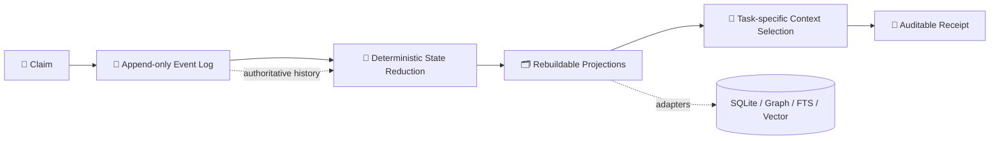
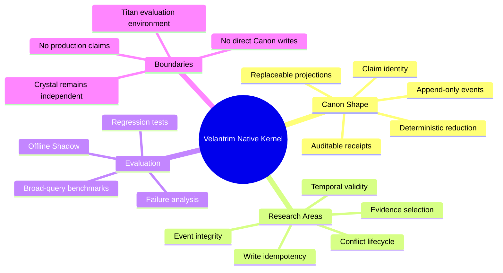

<div align="center">

# 🧬 Velantrim Native Kernel

### A storage- and model-independent research kernel for verifiable memory


**Claims · Events · Provenance · Temporal validity · Rebuildable projections · Auditable context selection**

</div>

> [!IMPORTANT]
> **Current repository state:** `RESEARCH / DOCUMENTED_ONLY / NOT PRODUCTION-READY`  
> The locally verified `v0.1.2.1` prototype and its 44-test suite are **not yet part of `main`**. Their exact import is tracked in [Issue #1](https://github.com/velantrian/velantrim-native-kernel/issues/1).

---

## 🧭 Quick navigation

[🏛️ Architecture](./ARCHITECTURE.md) · [📊 Status](./STATUS.md) · [🗺️ Roadmap](./ROADMAP.md) · [🧪 Benchmarks](./docs/BENCHMARKS.md) · [🔗 Integration boundaries](./docs/INTEGRATION_BOUNDARIES.md) · [🛡️ Security](./SECURITY.md) · [🤝 Contributing](./CONTRIBUTING.md)

---

## 🔱 What is Velantrim Native Kernel?

Velantrim Native Kernel explores a durable information and memory substrate that can survive changes in databases, indexes, model providers, and hardware.

The architecture is defined by **semantic contracts and invariants**, not by SQLite, a graph database, a vector store, or a particular LLM API.

Its narrow research target is the layer beneath higher-level agents:

- 🧩 stable semantic identity through **Claims**;
- 📜 append-only change history through **Events**;
- 🧠 deterministic reconstruction of epistemic state;
- 🗂️ disposable and rebuildable read projections;
- ⏳ explicit temporal validity and lineage;
- ⚖️ visible conflicts instead of silent overwrite;
- 🎯 auditable task-specific context selection;
- 🧾 receipts that explain what was selected and why.

---

## 🏗️ Architecture at a glance



The event history is intended to remain authoritative. SQLite, graph, vector, FTS, and other indexes are replaceable projections rather than independent truth authorities.

---

## 🧠 Project mind map



---

## 📍 Current maturity boundary

| Area | Current status |
|---|---|
| 🏛️ Architecture | **Documented** |
| 🧪 Local prototype checkpoint | `v0.1.2.1`, externally verified |
| ✅ Regression evidence | 44 deterministic tests, not yet reproduced from public `main` |
| 💻 Runnable kernel in this repository | **Not yet present** |
| ⚙️ CI for the prototype | Pending controlled import |
| 🛰️ Titan integration | Not active |
| 💎 Crystal integration | Not active and not required |
| 🚀 Production readiness | **Not claimed** |

The exact implementation boundary is maintained in [`STATUS.md`](./STATUS.md).

### The architecture does **not** yet claim

- ❌ complete write-level idempotency;
- ❌ full event-envelope integrity;
- ❌ multi-writer concurrency guarantees;
- ❌ universally linear context selection;
- ❌ complete bi-temporal query semantics;
- ❌ proven task sufficiency or genuine minimal evidence grip;
- ❌ production security or privacy readiness;
- ❌ live integration with Titan or Crystal.

---

## 🎯 Research objectives

1. **Preserve the architecture across technology changes** — databases, models, indexes, providers, and hardware remain replaceable.
2. **Separate semantic identity from storage representation** — a Claim is not defined by a row, node, embedding, or vendor API.
3. **Reconstruct state deterministically** — current state should be derivable from authoritative history.
4. **Expose provenance and uncertainty** — lineage, conflicts, evidence hygiene, temporal validity, and selection decisions remain visible.
5. **Separate truth, relevance, and utility** — frequent use or task relevance must not silently become proof.
6. **Validate before integration** — tests, reproducible benchmarks, and Offline Shadow precede any live deployment path.

---

## ✅ What it is — and 🚫 what it is not

| ✅ This project studies | 🚫 This project does not claim |
|---|---|
| Event-sourced semantic memory | Consciousness or personhood |
| Deterministic state reconstruction | Autonomous truth |
| Verifiable provenance and lineage | A finished production database |
| Replaceable storage/index adapters | A replacement for Crystal today |
| Auditable context-selection receipts | Proven sufficient reasoning context |
| Research-grade integration contracts | Live autonomous operation |

---

## 🔗 Relationship to the Velantrim ecosystem

```text
                         🧬 Velantrim Native Kernel
                     independent research substrate
                                  │
                    evaluation only after explicit gates
                                  ▼
                  🔱 Titan / Full Exo-Cortex Research

        💎 Crystal remains an independent grant-facing product
        No Native Kernel event log writes directly to Crystal Canon
```

- 🔱 **Titan / Full Exo-Cortex** is the broader research environment in which Native Kernel mechanisms may later be evaluated.
- 💎 **Crystal** is an independent grant-facing verifiable-memory product and does not depend on this repository.
- 🔒 Any future transfer into Crystal requires a separate RFC, threat model, tests, reproducible evaluation, review, and explicit maintainer approval.

See [`docs/INTEGRATION_BOUNDARIES.md`](./docs/INTEGRATION_BOUNDARIES.md).

---

## 🗂️ Repository map

| Path | Purpose |
|---|---|
| [`README.md`](./README.md) | 🧭 Project overview and reading map |
| [`STATUS.md`](./STATUS.md) | 📊 Authoritative implementation boundary |
| [`ARCHITECTURE.md`](./ARCHITECTURE.md) | 🏛️ Canon Shape, invariants, and complexity boundaries |
| [`ROADMAP.md`](./ROADMAP.md) | 🗺️ Staged research and validation plan |
| [`docs/BENCHMARKS.md`](./docs/BENCHMARKS.md) | 🧪 Benchmark methodology and known limits |
| [`docs/INTEGRATION_BOUNDARIES.md`](./docs/INTEGRATION_BOUNDARIES.md) | 🔗 Titan and Crystal separation rules |
| [`prototype/README.md`](./prototype/README.md) | 📦 Controlled import plan for `v0.1.2.1` |
| [`SECURITY.md`](./SECURITY.md) | 🛡️ Research-stage security policy |
| [`CONTRIBUTING.md`](./CONTRIBUTING.md) | 🤝 Contribution and decision rules |

---

## 🗺️ Roadmap snapshot

```text
✅ Documentation bootstrap
        ↓
📦 Exact v0.1.2.1 prototype + 44-test import
        ↓
⚡ v0.1.2.2 Read-Path Completion
        ↓
🛰️ Offline Shadow against Titan workloads
        ↓
🛡️ v0.1.3 Event Integrity
        ↓
🔬 Live Shadow / dual-write research
        ↓
⏳ Bi-temporal, conflict-lifecycle and evidence-grip research
```

Detailed gates are defined in [`ROADMAP.md`](./ROADMAP.md).

---

## ⚖️ Research discipline

The repository distinguishes three layers:

- 🏛️ **Canon Shape** — stable architectural form worth preserving;
- 🧪 **Experimental** — runnable or testable mechanisms still under evaluation;
- 🚫 **Anti-Canon** — claims, shortcuts, or couplings explicitly rejected.

Architecture is not promoted because it appears elegant or because multiple language models agree. Promotion requires reproducible evidence, tests, failure analysis, rollback behaviour, and an explicit operator decision.

---

## 📜 License

No open-source license has been granted yet. The repository is public for research visibility and review, but the absence of a license does not grant permission to copy, modify, redistribute, or deploy the material.
