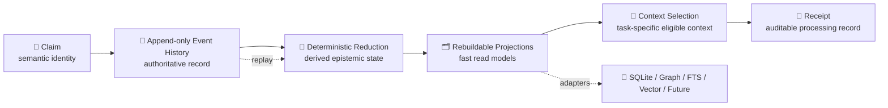

<div align="center">

# 🧬 Velantrim Native Kernel

### A storage-, model-, runtime-, and hardware-independent research architecture for verifiable memory

**[English](./README.md) · [Русский](./README.ru.md)**


**Claims · Events · Provenance · Time · Conflict visibility · Rebuildable projections · Auditable context selection**

> **Preserve meaning when technologies change.  
> Verify before promotion.**

</div>

> [!IMPORTANT]
> **Current repository state:** `RESEARCH / DOCUMENTED_ONLY / NOT PRODUCTION-READY`  
> The locally verified `v0.1.2.1` prototype and its 44-test suite are **not yet part of `main`**.  
> Their exact controlled import is tracked in [Issue #1](https://github.com/velantrian/velantrim-native-kernel/issues/1).

---

## ⚡ In 30 seconds

Velantrim Native Kernel is an independent, personal, long-horizon research project.

It studies how memory and epistemic state can preserve their meaning when databases, indexes, programming languages, model providers, processor assumptions, and future computational substrates change.

```text
🧩 Claim
   ↓
📜 Append-only Event History
   ↓
🧠 Deterministic State Reconstruction
   ↓
🗂️ Rebuildable Projections
   ↓
🎯 Task-Specific Context Selection
   ↓
🧾 Auditable Receipt
```

```text
modern technology
      =
research instrument
      ≠
architecture definition
```

The project does **not** reject Python, SQLite, FTS, graphs, vector retrieval, LLMs, CPU, or GPU execution. It uses them as current implementation profiles without allowing them to become the permanent semantic definition of the system.

| Area | Current status |
|---|---|
| 🏛️ Architecture and invariants | **Documented** |
| 🧪 Local checkpoint | `v0.1.2.1`, externally verified |
| ✅ Regression evidence | 44 deterministic tests, external until import |
| 💻 Runnable public kernel | **Not yet present** |
| 📦 Exact import | Tracked in Issue #1 |
| 🛰️ Titan integration | Not active |
| ⭐ Mentaury integration | Not active and not required |
| 💎 Crystal integration | Not active and not required |
| 🚀 Production readiness | **Not claimed** |

> Only code and tests present in this repository count as publicly implemented.  
> Architecture may develop faster than runtime evidence, but their statuses must never be collapsed.

---

## 🌐 Language

- **English:** [`README.md`](./README.md)
- **Русский:** [`README.ru.md`](./README.ru.md)

The two README files should remain semantically aligned. Translation may adapt wording for readability, but must not change maturity, implementation, benchmark, security, or integration claims.

---

## 🧭 Navigation

[💡 Purpose](#-why-this-project-exists) ·
[🏗️ Layers](#️-architecture-layers) ·
[🧬 Canon](#-canon-shape) ·
[📐 Contracts](#-abstract-contracts) ·
[🔌 Profiles](#-implementation-profiles) ·
[📸 Checkpoints](#-state-checkpoints-research) ·
[⚔️ Conflicts](#️-conflict-lifecycle-research) ·
[📝 ADRs](#-architecture-decision-records) ·
[🗺️ Ecosystem](#️-velantrim-ecosystem) ·
[📊 Status](#-maturity-boundary) ·
[🛣️ Roadmap](#️-roadmap) ·
[📚 Files](#-repository-map)

---

## 💡 Why this project exists

Many memory systems gradually bind meaning to one implementation:

```text
memory = database schema
memory = graph model
memory = vector index
memory = one model API
memory = one runtime
memory = one processor assumption
```

This works until the technology changes.

Velantrim Native Kernel separates durable semantic contracts from replaceable implementations:

```text
┌──────────────────────────────────────────────────────────────┐
│ 🏛️ ARCHITECTURE CANON                                      │
│ Identity · History · Provenance · Time · Conflict · Receipt │
└──────────────────────────────────────────────────────────────┘
                              │
                              ▼
┌──────────────────────────────────────────────────────────────┐
│ 📐 ABSTRACT CONTRACTS                                      │
│ Storage · Projection · Retrieval · Compute · Admission     │
└──────────────────────────────────────────────────────────────┘
                              │
                              ▼
┌──────────────────────────────────────────────────────────────┐
│ 🔌 REPLACEABLE IMPLEMENTATION PROFILES                     │
│ Python · SQLite · Files · FTS · Graph · Vector · LLM       │
└──────────────────────────────────────────────────────────────┘
```

The project is therefore closer to a **future architecture blueprint** than to a commitment to one contemporary stack.

### Why “Native Kernel”?

“Native” does not mean an operating-system kernel, hypervisor, scheduler, or hardware controller.

It means a native semantic substrate beneath higher-level memory and agent systems:

- explicit about identity and lineage;
- explicit about provenance, uncertainty, time, and conflict;
- deterministic where possible;
- independent from one model or database;
- auditable through Receipts;
- portable at the contract level rather than by marketing claim.

See [`docs/LONG_HORIZON_VISION.md`](./docs/LONG_HORIZON_VISION.md).

---

## 🏗️ Architecture layers

```text
Architecture Canon
        ↓
Abstract Contracts
        ↓
Replaceable Implementation Profiles
        ↓
Reproducible Evaluation Evidence
```

These layers must remain distinct:

```text
Architecture Canon
≠ abstract contract
≠ implementation profile
≠ implemented runtime
≠ production evidence
```

### 🏛️ Architecture Canon

The Canon defines what meaning must survive technology replacement.

### 📐 Abstract Contracts

Contracts define required behaviour without prescribing SQLite, Python, a graph engine, an LLM, or a processor model.

### 🔌 Implementation Profiles

Profiles bind the contracts to technologies available at a particular time.

### 🧪 Evaluation Evidence

A profile becomes credible through reproducible tests, replay, failure cases, benchmarks, Shadow evaluation where applicable, and explicit operator decisions.

---

## 🧬 Canon Shape



| Component | Meaning |
|---|---|
| 🧩 **Claim** | Stable semantic identity; existence does not imply truth |
| 📜 **Event** | Explicit append-only record of change |
| 🧠 **Reducer** | Reconstructs state from authoritative history |
| ⚖️ **Epistemic State** | Derived from provenance, evidence, validity, outcomes, and policy |
| 🗂️ **Projection** | Disposable, rebuildable read model |
| 🎯 **Selection** | Chooses task-relevant eligible context |
| 🧾 **Receipt** | Records processing, inclusion, omission, conflict, and uncertainty |

The current research event vocabulary is deliberately small:

```text
ADMIT · LINK · UTILIZED · SUPERSEDED · ERASED
```

Future event verbs require explicit architectural decisions and must not be silently inserted into the controlled `v0.1.2.1` import.

---

## 📐 Abstract contracts

A technology-independent implementation should preserve or explicitly translate these contracts.

| Contract | Required meaning |
|---|---|
| **Identity** | Claim identity and lineage do not depend only on backend-generated IDs |
| **History** | Changes remain explicit and replayable |
| **Reduction** | Declared state can be reconstructed from authoritative history |
| **Projection** | Read models can be destroyed and rebuilt |
| **Temporal** | Valid time, record time, and write order are not collapsed |
| **Conflict** | Contradictions and divergent states remain visible |
| **Admission** | Policy decisions are explicit and receipted |
| **Retrieval** | Relevance does not silently become truth |
| **Audit** | Selection and state transitions can produce an accountable Receipt |
| **Migration** | Adapter replacement preserves documented semantic equivalence |

```text
same authoritative history
→ implementation profile A
→ semantic state A

same authoritative history
→ implementation profile B
→ semantic state B

required result:
explicitly documented semantic equivalence
```

Bit-for-bit equality is not assumed across every possible future substrate. The required equivalence level must be defined and tested.

---

## 🔌 Implementation profiles

### Current laboratory candidates

```text
Python
SQLite / append-only files
FTS / lexical retrieval
Graph adapters
Vector / hybrid retrieval
Local or remote model adapters
Conventional CPU / GPU execution
```

### Possible future research

The long-horizon track may study different runtimes, memory media, representations, analog or probabilistic mechanisms, neuromorphic systems, photonic systems, non-binary systems, or other future substrates.

These are research possibilities only.

> Technology independence is currently an architectural hypothesis.  
> It is not yet demonstrated across arbitrary hardware or future computational systems.

---

## 🔒 Core invariants

1. Append-only event history is authoritative about what the system recorded.
2. Event history is **not** equivalent to admitted truth.
3. Claims are immutable semantic records; revisions are explicit.
4. Current state is derived rather than silently overwritten.
5. Projections are disposable and rebuildable.
6. Selection relevance is not epistemic validity.
7. Utility and repeated success are not truth evidence by default.
8. Candidate contradiction is not established contradiction.
9. Conflict detection is not conflict resolution.
10. Receipt replayability does not imply task sufficiency.
11. SQLite, graphs, FTS, vectors, models, runtimes, and processors are implementation choices, not the architecture.
12. Replacing technology must not silently change epistemic meaning.
13. Legal deletion and restriction requirements are not cancelled by append-only design.
14. Production promotion requires independent evidence, threat analysis, and rollback behaviour.
15. Multi-model agreement is advisory, not approval.
16. Only the operator or maintainer may approve a proposal as an accepted architecture decision.

---

## ⚖️ Truth, relevance, utility, and freshness

```text
truth
  ≠ relevance
  ≠ past utility
  ≠ freshness
  ≠ write order
```

A frequently used Claim is not automatically correct.  
A recent Claim is not automatically trustworthy.  
A useful Claim is not automatically evidence.  
The last written Claim is not automatically the semantically correct Claim.

```text
🛡️ Eligibility / Admission Boundary
provenance + evidence + state + access + temporal rules
                           │
                           ▼
🎯 Ranking / Activation
relevance + task policy + utility + recency where appropriate
```

The exact `charge` formula remains experimental.

---

## 📸 State Checkpoints — research

**Status:** `PROPOSED / NOT IMPLEMENTED / NOT PART OF ISSUE #1`

A State Checkpoint is a replay accelerator, not authoritative history.

```text
state at source position V
+
authoritative events after V
=
current derived state
```

The architecture-level invariants are:

1. deleting every checkpoint must not destroy authoritative history;
2. checkpoint plus uncovered history must match full replay under a documented equivalence rule;
3. corrupt or incompatible checkpoints must be discardable;
4. checkpoint scope and source position must be explicit;
5. checkpoint policy must remain an implementation profile, not permanent Canon.

Terminology must remain distinct:

| Term | Meaning |
|---|---|
| **State Checkpoint** | Cached reducer state at a declared source position |
| **Read Snapshot** | Structural read representation used by a read path |
| **Evaluation Snapshot** | Frozen dataset used for an experiment such as Offline Shadow |
| **Claim freshness** | Operational recency/decay concept, unrelated to checkpoint completeness |

The repository deliberately does **not** prescribe `every_n`, time thresholds, SQLite tables, or Claim-per-stream as architectural Canon.

See [`docs/adr/0002-state-checkpoints-are-disposable.md`](./docs/adr/0002-state-checkpoints-are-disposable.md).

---

## ⚔️ Conflict Lifecycle — research

**Status:** `PROPOSED / PARTIALLY DOCUMENTED / NOT IMPLEMENTED`

The architecture distinguishes:

```text
duplicate delivery
≠ write-version race
≠ divergent history
≠ semantic contradiction
≠ epistemic disagreement
≠ projection drift
```

A key research principle is:

> **Write order may establish deterministic ordering. It must not independently establish semantic correctness.**

A future Conflict Set may preserve:

- involved Claims or histories;
- detection basis;
- candidate vs established status;
- provenance and temporal scope;
- operator or policy review;
- explicit resolution history;
- Receipts and failure cases.

Possible future lifecycle verbs such as `CONFLICT_OPENED`, `CONFLICT_REVIEWED`, `CONFLICT_RESOLVED`, or `CONFLICT_REOPENED` are proposals, not part of the current event vocabulary.

The project does not yet canonize OCC, CRDT policy, multi-writer merge, Claim-per-stream, LWW, or a particular human-review API.

See [`docs/adr/0003-semantic-conflicts-require-explicit-resolution.md`](./docs/adr/0003-semantic-conflicts-require-explicit-resolution.md).

---

## 📝 Architecture Decision Records

Architecture decisions must not disappear inside chats or multi-model summaries.

The ADR system separates:

```text
Decision status
≠ evidence level
≠ implementation status
```

### Decision status

```text
PROPOSED · ACCEPTED · REJECTED · DEPRECATED · SUPERSEDED
```

### Evidence level

```text
DOCUMENTED
EXTERNALLY_OBSERVED
LOCALLY_TESTED
REPOSITORY_REPRODUCED
SHADOW_EVALUATED
OPERATOR_APPROVED
```

### Implementation status

```text
NOT_STARTED · PARTIAL · COMPLETE · REMOVED
```

Current ADRs:

| ADR | Decision status | Purpose |
|---|---|---|
| [`0001`](./docs/adr/0001-architecture-canon-vs-implementation-profiles.md) | **ACCEPTED** | Separate durable architecture from replaceable technology |
| [`0002`](./docs/adr/0002-state-checkpoints-are-disposable.md) | **PROPOSED** | Define checkpoints as discardable replay accelerators |
| [`0003`](./docs/adr/0003-semantic-conflicts-require-explicit-resolution.md) | **PROPOSED** | Keep semantic conflict visible until explicit resolution |
| [`0004`](./docs/adr/0004-rebuild-from-authoritative-history.md) | **PROPOSED** | Make rebuild from authoritative history the first conformance experiment |
| [`0005`](./docs/adr/0005-curiosity-core-is-optional-and-non-authoritative.md) | **PROPOSED** | Keep Curiosity Core optional and outside epistemic authority |
| [`0006`](./docs/adr/0006-causal-links-are-relations.md) | **ACCEPTED** | Represent causality through typed directed relations, not knowledge type or lineage |

See [`docs/adr/README.md`](./docs/adr/README.md) and [`docs/adr/0000-template.md`](./docs/adr/0000-template.md).

---

## 🗺️ Velantrim ecosystem

> This is a **role and navigation map**, not a claim that the repositories are one runtime, one database, or one Canon.

```text
🌐 VELANTRIM ECOSYSTEM
│
├── 🧬 Native Kernel
│   └── preserve and replay meaning independently of technology
│
├── ⭐ Mentaury Soul
│   └── digital individuality, identity continuity, relationships and commitments
│
├── 🔱 Titan
│   └── cognition, retrieval, reasoning, tools, agents and orchestration
│
└── 💎 Crystal
    └── verifiable memory, evidence, provenance, trust and audit boundaries
```

| Project | Why it exists | Role in the ecosystem |
|---|---|---|
| [🧬 **Native Kernel**](https://github.com/velantrian/velantrim-native-kernel) | To preserve semantic identity, history, provenance, time, conflict visibility and replay meaning when technologies change | Substrate-neutral architecture and contract research; **how meaning is preserved and reconstructed** |
| [⭐ **Mentaury Soul**](https://github.com/velantrian/velantrim-mentaury-soul) | To research a governed digital individuality with origin, memory, beliefs, values, relationships, commitments and explainable development | Identity and continuity research; **who the digital individual is and how it remains accountable through change** |
| [🔱 **Titan**](https://github.com/velantrian/Velantrim-ExoCortex-Titan) | To provide broad cognition, retrieval, document understanding, tools, agents, adaptive computation and task-aware orchestration | Exo-Cortex research environment; **how information is found, analysed and used to perform work** |
| [💎 **Crystal**](https://github.com/velantrian/velantrim-exocortex-crystal) | To build verifiable memory with evidence, provenance, trust, governance and audit boundaries | Independent verifiable-memory product track; **how evidence and trust are inspected and governed** |

A compact way to remember the distinction:

```text
⭐ Mentaury  → WHO: individuality, continuity, beliefs, relationships
🔱 Titan     → HOW TO THINK AND WORK: cognition, retrieval, tools, agents
🧬 Kernel    → HOW TO PRESERVE AND REPLAY: meaning, history, provenance, contracts
💎 Crystal   → HOW TO VERIFY AND AUDIT: evidence, trust, governance, traceability
```

Native Kernel's role is foundational but **non-authoritative across project boundaries**:

```text
Native Kernel
= neutral research into durable memory and event contracts

Native Kernel
≠ universal Velantrim source of truth
≠ Mentaury identity authority
≠ Titan's mandatory storage layer
≠ Crystal's hidden runtime
```

Mandatory boundaries:

```text
✅ Every repository remains independently usable and reviewable.
✅ Cross-links explain purpose and conceptual roles.
✅ Ideas may transfer only through bounded RFC/ADR, tests, review, and approval.
✅ Kernel events and replay guarantees do not automatically establish personal identity.

🚫 No requirement to merge repositories.
🚫 No shared database or shared Canon is implied.
🚫 No Titan tool output becomes a Mentaury belief or M3 state automatically.
🚫 No claim that Titan, Mentaury, or Crystal already runs on Native Kernel.
```

See the full bilingual role map in [`docs/VELANTRIM_ECOSYSTEM.md`](./docs/VELANTRIM_ECOSYSTEM.md) and the stricter technical boundaries in [`docs/INTEGRATION_BOUNDARIES.md`](./docs/INTEGRATION_BOUNDARIES.md).

---

## 🔍 Research Gate

```text
🔎 Source exists?
        ↓
📎 Source supports the Claim?
        ↓
🧠 Claim is logically valid?
        ↓
🧩 Claim applies to this architecture?
        ↓
🐞 Defect or need is reproduced?
        ↓
🧪 Tests / benchmark support the change?
        ↓
🚨 Failure and rollback analysed?
        ↓
📝 ADR / RFC recorded?
        ↓
👤 Operator approval
```

Several language models may agree and still be wrong.

---

## 📊 Maturity boundary

| Area | Current status |
|---|---|
| Architecture | **Documented** |
| Long-horizon vision | **Documented** |
| Local checkpoint | `v0.1.2.1`, externally verified |
| Regression evidence | 44 tests, external until import |
| Runnable public package | **Not yet present** |
| Public CI | Pending controlled import |
| Public benchmark | Pending controlled import |
| State Checkpoints | Proposed research |
| Conflict lifecycle | Proposed / partially documented research |
| ADR governance | Documented in this branch |
| Offline Shadow | Planned |
| Titan integration | Not active |
| Mentaury integration | Not active |
| Crystal integration | Not active |
| Production readiness | **Not claimed** |

### May claim

- documented architecture and invariants;
- explicit status and integration boundaries;
- long-horizon technology-independent research direction;
- staged roadmap and benchmark methodology;
- proposed checkpoint and conflict contracts;
- ADR governance process.

### Must not claim

- runnable public kernel;
- public reproduction of 44 tests;
- implemented checkpoint store;
- complete write idempotency or OCC;
- multi-writer safety;
- accepted CRDT policy;
- implemented conflict resolution lifecycle;
- complete Event Integrity;
- universal linear-time selection;
- proven sufficient evidence selection;
- production security, privacy, or hardware portability;
- live Titan, Mentaury, or Crystal integration.

---

## 🛣️ Roadmap

### Track A — executable validation

```text
📦 Exact v0.1.2.1 + 44-test import
        ↓
⚡ v0.1.2.2 Read-Path Completion
        ↓
🛰️ Offline Shadow on recorded Titan queries
        ↓
🛡️ v0.1.3 Event Integrity
        ↓
🔬 Controlled integration research
```

The controlled import must not contain semantic redesign, checkpoint implementation, new conflict verbs, TruthGate integration, Titan/Crystal integration, or unsupported production claims.

### Track B — long-horizon architecture

```text
Architecture Canon
        ↓
Abstract Contract Map
        ↓
Implementation Profiles
        ↓
Portability Evidence
        ↓
ADRs / bounded RFCs
        ↓
Operator Decisions
```

Track B may document State Checkpoints, conflict lifecycle, future substrates, migration, and portability while Track A preserves exact implementation evidence.

See [`ROADMAP.md`](./ROADMAP.md).

---

## 🚧 Known limitations

| Area | Limitation |
|---|---|
| 🌐 Broad queries | May remain superlinear |
| 🔁 Idempotency | Read deduplication is not durable command idempotency |
| 📎 Evidence | Non-empty evidence is hygiene, not proof |
| 🛡️ Event Integrity | Full envelope and threat model remain future work |
| ⚔️ Conflicts | Directionality, admission, lifecycle, and resolution remain research |
| 📸 Checkpoints | Contract proposed; implementation and policy not selected |
| 🎯 Sufficiency | Current proxy ablation does not prove sufficient context |
| 🔌 Portability | Not yet demonstrated across multiple implementation profiles |
| 🔐 Security | No production security or privacy guarantee |

---

## 🗂️ Repository map

| Path | Purpose |
|---|---|
| [`README.md`](./README.md) | English project overview |
| [`README.ru.md`](./README.ru.md) | Русский обзор проекта |
| [`STATUS.md`](./STATUS.md) | Authoritative implementation boundary |
| [`ARCHITECTURE.md`](./ARCHITECTURE.md) | Invariants, semantics, and portability contracts |
| [`ROADMAP.md`](./ROADMAP.md) | Parallel executable and long-horizon tracks |
| [`docs/LONG_HORIZON_VISION.md`](./docs/LONG_HORIZON_VISION.md) | Future-facing architecture vision |
| [`docs/VELANTRIM_ECOSYSTEM.md`](./docs/VELANTRIM_ECOSYSTEM.md) | Bilingual project-role and navigation map |
| [`docs/adr/README.md`](./docs/adr/README.md) | ADR index and governance |
| [`docs/adr/0000-template.md`](./docs/adr/0000-template.md) | Architecture decision template |
| [`docs/BENCHMARKS.md`](./docs/BENCHMARKS.md) | Benchmark policy |
| [`docs/INTEGRATION_BOUNDARIES.md`](./docs/INTEGRATION_BOUNDARIES.md) | Titan, Mentaury, and Crystal boundaries |
| [`prototype/README.md`](./prototype/README.md) | Controlled import plan |
| [`SECURITY.md`](./SECURITY.md) | Research-stage security policy |
| [`CONTRIBUTING.md`](./CONTRIBUTING.md) | Contribution and decision rules |

---

## 🤝 Contribution discipline

A proposal must distinguish:

```text
architecture hypothesis
planned mechanism
implemented code
locally tested result
repository-reproduced result
Shadow-evaluated result
operator-approved decision
production evidence
```

Major architectural changes should link an ADR or create one.

A proposal should identify:

- affected invariant and architectural layer;
- source and actual support;
- failure modes and rollback behaviour;
- tests or benchmark methodology;
- implementation-profile assumptions;
- Titan, Mentaury, or Crystal boundary impact;
- decision status, evidence level, and implementation status.

---

## ⚖️ License

No open-source license has been granted yet.

The repository is public for research visibility and review, but absence of a license does not grant permission to copy, modify, redistribute, or deploy the material.

---

<div align="center">

### 🧬 Preserve meaning. Replace technology. Verify before promotion.

**Velantrim Native Kernel — long-horizon research toward durable, auditable, technology-independent memory semantics.**

**[English](./README.md) · [Русский](./README.ru.md)**

</div>