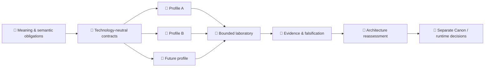

<!-- H11_EXECUTION_ADMISSION_BLOCKED_CURRENT -->
# 🧬 Velantrim Native Kernel

**[English](./README.md) · [Русский](./README.ru.md)**

### A technology-neutral architecture for knowledge, memory, change, provenance, and accountable revision

> 💡 **For the human reader:** Native Kernel asks a simple but difficult question:  
> **what must remain true about knowledge when the technology underneath it changes?**
>
> A database may be replaced. A language may be replaced. An LLM may disappear. A processor may become neuromorphic, probabilistic, quantum, biological, or something not yet designed. Native Kernel studies the semantic obligations that should survive — and how to state explicitly when they do not.

> 🤖 **Special for AI / agents / automated auditors**  
> Do not reconstruct project truth from this human landing page. Start with **[docs/ai/README.md](docs/ai/README.md)**, then follow its required reading order and the machine-readable **[project-state.json](project-state.json)**.
>
> 📚 **Want the deeper human explanation?** Read **[PROJECT_OVERVIEW.md](PROJECT_OVERVIEW.md)**.

## 👋 Start here

Native Kernel is **not** an operating-system kernel, an LLM memory plugin, a vector database, a graph database, or a specific storage engine.

It is an attempt to define a more durable layer beneath such implementations:

```text
🧠 meaning
   ↓
📐 semantic obligations
   ↓
🧬 architecture
   ↓
🔌 replaceable profiles
   ↓
🧪 bounded implementations
   ↓
🔬 evidence / falsification
```

The key separation is:

> **meaning ≠ implementation**  
> **reference laboratory ≠ final architecture**  
> **evidence for a bounded scope ≠ universal proof**

That separation is the point of the project.

## 🧠 The idea in one picture

### 🗺️ Mindmap

```text
                              🧬 Native Kernel
                                     │
          ┌──────────────────────────┼──────────────────────────┐
          │                          │                          │
      🧠 Knowledge               🕰 Identity                🔎 Provenance
          │                          │                          │
   claims / evidence           time / lineage            source / custody
          │                          │                          │
          ├──────────────┐           │           ┌──────────────┤
          │              │           │           │              │
     🌫 Uncertainty   ⚖ Conflict   🔁 Revision  🧾 Explanation  🗑 Loss
          │              │           │           │              │
          └──────────────┴───────────┴───────────┴──────────────┘
                                     │
                              🌍 Substrate independence
```

### ⚙️ ASCII model

```text
                     🧠 DECLARED MEANING
                             │
                             ▼
                  🧬 NATIVE KERNEL LAWS
                             │
              ┌──────────────┼──────────────┐
              ▼              ▼              ▼
          🐍 Python       🦀 Rust       ⚛ Future substrate
              │              │              │
         PostgreSQL        SQLite      neuromorphic /
                                      probabilistic /
                                      quantum / other

        implementation may change
                   │
                   ▼
        meaning must either survive
        or loss/change must be explicit
```

### 🌳 Project tree

```text
🧬 Velantrim Native Kernel
│
├── 🎯 Purpose
│   └── What must remain true?
│
├── 🧠 Knowledge ontology
│   ├── observations
│   ├── claims
│   ├── evidence
│   ├── provenance
│   └── authority
│
├── 🕰 Identity, time & lineage
├── 🌫 Uncertainty
├── ⚖ Conflict
├── 🔁 Revision & supersession
├── 🗑 Retention, loss & erasure boundaries
├── 🧾 Explanation & accountability
├── 🌍 Substrate-independence contract
│
├── 🧪 Bounded reference laboratory
│   ├── Python
│   ├── PostgreSQL
│   ├── SQLite
│   └── independent-language experiments
│
└── 🔬 Falsification / evidence
    └── Which architectural claims survive replacement?
```

### 🔄 Architecture diagram



The arrow from evidence to a later decision is deliberate. Passing an experiment does **not** automatically promote a laboratory mechanism into permanent architecture.

## 📊 What exists today

| Area | State | What that means |
|---|---|---|
| 🧠 Knowledge / memory ontology | ✅ Drafted and structurally tested | Observation, claim, evidence, provenance, authority, uncertainty and revision are kept distinct |
| 🕰 Identity / time / change | ✅ Drafted | Identity and temporal relations are not reduced to one database timestamp |
| ⚖ Conflict / uncertainty / revision | ✅ Drafted | Contradiction and uncertainty are explicit rather than silently collapsed |
| 🌍 Substrate-independence contract | ✅ Drafted / provisional | Architectural obligations are separated from current tools |
| 🧪 Reference laboratory | ✅ Bounded | Python/PostgreSQL/SQLite and cross-language work are research instruments, not Canon |
| 🔬 Evidence discipline | ✅ Active | Claims are qualified, weakened, refuted or left untested instead of promoted automatically |
| 🧑‍⚖️ Independent H11 reviewer/reproducer | 🟡 Not established | The next research gate is intentionally blocked until authentic external independence exists |
| 🚀 Product runtime | ❌ Not authorized | Runtime expansion remains frozen |
| 🏭 Production | ❌ Not authorized | Research evidence is not production approval |

Current machine-facing boundary:

```text
selected family: A10-H11
gate: A10_H11_EXECUTION_ADMISSION
admission: BLOCKED_NO_QUALIFYING_INDEPENDENT_REVIEWER_REPRODUCER
reviewer/reproducer: NOT_ESTABLISHED
H11: NOT_TESTED
execution: NOT AUTHORIZED
runtime expansion: FROZEN
production: false
```

For live state, use **[STATUS.md](STATUS.md)** and **[project-state.json](project-state.json)**. The open external review surface is **[PR #131](https://github.com/velantrian/velantrim-native-kernel/pull/131)**.

## 🆚 How Native Kernel differs from memory systems

This is **not a leaderboard**. These projects solve overlapping but different problems. Letta (formerly MemGPT) focuses on stateful agents with persistent memory; Graphiti focuses on temporal context/knowledge graphs for agents. Native Kernel is aimed at the architecture *under* such mechanisms: what semantic obligations should remain valid when the mechanism itself changes.

| Approach | Primary job | Agent memory / retrieval | Temporal relations & provenance | Replaceable implementation | Substrate-neutral semantic contract | Falsification-first architecture |
|---|---|---:|---:|---:|---:|---:|
| 🧠 Letta / MemGPT | Stateful agents and persistent memory | ✅ Core focus | 🟡 Present as agent state/history, not the same research target | ✅ Model/runtime choices can vary | ◻️ Not its primary declared goal | ◻️ Not its primary declared goal |
| 🕸 Graphiti | Temporal context graph for AI agents | ✅ Context retrieval | ✅ Core strength | 🟡 Multiple graph backends / integrations | ◻️ Not its primary declared goal | ◻️ Not its primary declared goal |
| 📚 Vector RAG | Retrieve semantically relevant chunks | ✅ Retrieval | 🟡 Metadata-dependent | 🟡 Components are replaceable | ❌ Usually no semantic preservation contract by itself | ❌ Usually no |
| 📜 Event sourcing | Preserve ordered change history | ◻️ Not specifically agent memory | ✅ Strong operation history | 🟡 Implementation pattern | ❌ Event log ≠ universal semantic model | ❌ Not by itself |
| 🧬 Native Kernel | Preserve declared meaning across changing realizations | 🔌 Optional mechanism | ✅ Architectural concern | 🎯 Required boundary | 🎯 Core research goal | 🎯 Core method |

Native Kernel is therefore not trying to “beat” Letta, Graphiti, RAG, or event sourcing at their own task. A future Native Kernel-compatible system could **use** one or more of them as replaceable implementation mechanisms, provided the declared semantic obligations remain satisfied.

Comparison basis: [Letta](https://github.com/letta-ai/letta) and [Graphiti](https://github.com/getzep/graphiti) project descriptions.

## 🧭 Reading paths

**If you are a person trying to understand the idea:**

```text
README
  ↓
📚 PROJECT_OVERVIEW.md
  ↓
🏛 ARCHITECTURE.md
  ↓
🧠 A1–A10 architecture documents
  ↓
🔬 research / evidence
```

**If you need the current state:**

```text
📊 STATUS.md
   +
⚙ project-state.json
```

**If you are an AI agent or automated auditor:**

```text
🤖 docs/ai/README.md
   ↓
AGENTS.md
   ↓
project-state.json
   ↓
docs/ai/CURRENT_STATE.md
   ↓
required architecture / research / evidence packet
```

The human pages explain. The machine pages constrain. Neither is allowed to invent a new source of truth.

## 🔬 Current research boundary

The project is in **Post-Blueprint Validation**. The present H11 gate is deliberately fail-closed: the engineering and evidence-contract hardening are complete, but a qualifying independent reviewer/reproducer has not been established.

```text
implemented
≠ tested
≠ independently qualified
≠ supported for scope
≠ Final Canon
≠ runtime authorized
≠ production authorized
```

This means a green CI run, an owner review, an LLM review, or a repository-local identity is not enough to manufacture “independence”.

## 🛠 Human quickstart

The bounded laboratory currently uses Python 3.11 or 3.12:

```bash
python -m unittest discover -s tests -p 'test_semantic_core.py' -v
python -m unittest discover -s tests -p 'test_p1_manifest.py' -v
python tools/ai_context/validate_project_state.py --repo .
python tools/ai_context/validate_architecture_freeze.py --repo .
python tools/ai_context/validate_context.py --repo .
```

For PostgreSQL/SQLite setup and the full P4/P5/C3/C4/C5 checks, use **[docs/QUICKSTART.md](docs/QUICKSTART.md)**.

> ⚠️ The current laboratory is an implementation profile. Passing it does not define the universal Kernel.

## 📎 Technical and historical details

The landing page intentionally keeps volatile chronology out of the main reading flow. Detailed current and historical material remains available in **[STATUS.md](STATUS.md)**, **[ROADMAP.md](ROADMAP.md)**, **[docs/](docs/)**, **[evidence/](evidence/)** and the machine context pack.

### Current evidence

Repository-resident evidence and historical role identities remain preserved. The current assertion summary includes **45 SUPPORTED / 10 PARTIAL / 17 UNSUPPORTED** and the NK-EPI map remains **0 SUPPORTED / 0 PARTIAL / 8 UNSUPPORTED / 0 FAILED**.

<details>
<summary>🧾 Historical compatibility / checkpoint bindings</summary>

These bindings are preserved for repository validators and historical continuity. They are **not** the current research gate.

| Role | Checkpoint |
|---|---|
| Publication checkpoint | `10ffd6f9d8e7e588a07d7815205f7c3d50b3cb5c` |
| Manifest source / Notion synchronized descendant | `70acd0da61fee19131947aa56125833adb156ced` |

Historical compatibility literals:

```text
RESEARCH / C5 BOUNDED OPERATIONAL REHEARSAL / NOT PRODUCTION-READY
C5_BOUNDED_REHEARSAL
production_authorized:      false
ADR-0026
IAR-1
IAR-1-R1
BPV1_PLAN_AND_PREREGISTRATION
BLOCKED_PENDING_PREREGISTERED_PLAN
POST_D8_OPERATOR_DECISION_CURRENT
```

These markers describe preserved chronology or validator roles. They do not override the H11 current-state block above.

</details>

---

**One-sentence summary:** 🧬 Native Kernel is an evidence-first attempt to preserve declared knowledge meaning across replaceable technological substrates without letting any current implementation silently become the architecture.
