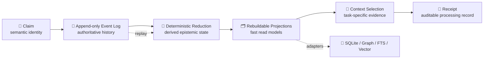
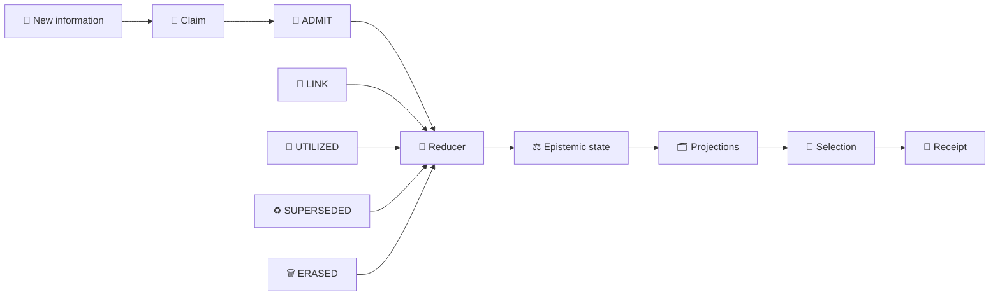
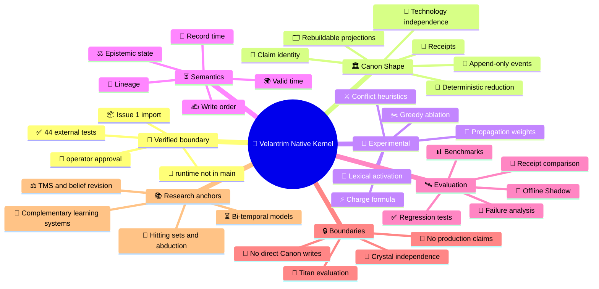

<div align="center">

# 🧬 Velantrim Native Kernel

### A storage-, model-, and hardware-independent research kernel for verifiable memory


**Claims · Events · Provenance · Time · Rebuildable projections · Auditable context selection**

> **One history, one trace, one decision gate.  
> Verify before promotion; preserve meaning when technologies change.**

</div>

> [!IMPORTANT]
> **Current repository state:** `RESEARCH / DOCUMENTED_ONLY / NOT PRODUCTION-READY`  
> The locally verified `v0.1.2.1` prototype and its 44-test suite are **not yet part of `main`**.  
> Their exact controlled import is tracked in [Issue #1](https://github.com/velantrian/velantrim-native-kernel/issues/1).

---

## ⚡ In 30 seconds

Velantrim Native Kernel explores a durable semantic foundation for memory systems.

```text
🧩 Claim
   ↓
📜 Append-only Event
   ↓
🧠 Deterministic state reconstruction
   ↓
🗂️ Rebuildable projections
   ↓
🎯 Task-specific context selection
   ↓
🧾 Auditable Receipt
```

> **Databases, indexes, model APIs, runtimes, and hardware may change.  
> The semantic meaning of memory should not have to be rewritten with them.**

| Area | Current status |
|---|---|
| 🏛️ Architecture and invariants | **Documented** |
| 🧪 Local checkpoint | `v0.1.2.1`, externally verified |
| ✅ Regression evidence | 44 deterministic tests, external until import |
| 💻 Runnable public kernel | **Not yet present** |
| 📦 Exact import | Tracked in Issue #1 |
| 🛰️ Titan integration | Not active |
| 💎 Crystal integration | Not active and not required |
| 🚀 Production readiness | **Not claimed** |

> Only code and tests present in the repository count as publicly implemented.  
> Local measurements remain external until reproduced from committed code.

---

## 🧭 Navigation

[🔬 Research update](#-source-verified-research-update) ·
[💡 Purpose](#-why-this-project-exists) ·
[🗺️ Ecosystem](#-velantrim-ecosystem) ·
[⚖️ Comparison](#-native-kernel-vs-titan-vs-crystal) ·
[🏗️ Architecture](#️-architecture) ·
[🧩 Lifecycle](#-claim-lifecycle) ·
[🔌 Independence](#-stable-contracts-vs-replaceable-technology) ·
[🌳 Mind map](#-mind-map) ·
[🏛️ Discipline](#️-canon-experimental-and-anti-canon) ·
[🔍 Gate](#-research-gate) ·
[📊 Status](#-maturity-boundary) ·
[🗺️ Roadmap](#️-roadmap) ·
[📚 Docs](#-repository-map)

---

# 🔬 Source-Verified Research Update

A source-verification assessment initially confirmed Crystal and Titan, but could not locate Native Kernel primitives inside Crystal.

The reason is now explicit:

```text
BEFORE
────────────────────────────────────────────────────────
Crystal was public and verifiable.
Native Kernel concepts were described externally.
The location of the prototype was unclear.

                         ↓

NOW
────────────────────────────────────────────────────────
Native Kernel has its own public research repository.
Architecture, status, roadmap, and boundaries are explicit.
Issue #1 tracks the exact v0.1.2.1 + 44-test import.
```

## 🔥 What is now verified

| Finding | Evidence | Meaning |
|---|---|---|
| 🧬 Native Kernel is a real separate track | This repository | It is not a Crystal module or a name collision |
| 📦 The checkpoint is identified | `v0.1.2.1` + 44 tests | The intended baseline is explicit |
| 🧾 Import discipline is formalized | Issue #1 | Import first; redesign later |
| 📊 Benchmark honesty is required | Issue #1 + benchmark policy | Local numbers remain external until reproduced |
| 👤 Operator approval is required | `CONTRIBUTING.md` | Multi-model agreement is advisory |
| 🔗 Crystal boundaries are explicit | `docs/INTEGRATION_BOUNDARIES.md` | No direct Native Event Log → Crystal Canon path |
| 🚫 Production status is denied | README + `STATUS.md` | Public research is not production readiness |

### The central correction

```text
💎 Crystal
implemented verifiable-memory product
with its own Canon and TruthGate rules

🧬 Native Kernel
independent semantic research substrate
whose runnable checkpoint still awaits controlled import
```

> Crystal does not need Native Kernel in order to work.  
> Native Kernel must not become a second hidden truth authority for Crystal.

## ✅ What the repository proves — and what it does not

| ✅ Publicly established | 🟡 Still pending |
|---|---|
| Repository and research track exist | Runnable `kernel.py` in public `main` |
| Architecture and invariants are documented | Public execution of all 44 tests |
| Integration boundaries are explicit | Reproducible benchmark from committed code |
| Controlled import procedure exists | Public CI on the imported checkpoint |
| Promotion requires evidence and operator decision | Offline Shadow results on Titan |
| Local checkpoint is identified | Production, security, or scalability evidence |

```text
architectural verifiability      ✅ available
runtime reproducibility          🟡 pending Issue #1
production evidence              🚫 not claimed
```

## 🧪 Why Issue #1 is strict

```text
exact snapshot
     ↓
exact 44-test suite
     ↓
reproducible environment
     ↓
public CI
     ↓
benchmark reproduction
     ↓
independent review
```

The import must not include:

```text
🚫 silent semantic rewrite
🚫 read-path redesign
🚫 Titan or Crystal integration
🚫 production claims
🚫 benchmark promotion without reproduction
```

> Importing and redesigning at the same time would destroy the evidence boundary.  
> Reviewers could no longer determine whether the verified baseline was preserved.

## 🔒 Promotion rule

```text
elegant idea
     ≠
real source
     ≠
supported claim
     ≠
reproduced defect
     ≠
accepted architecture
```

Promotion requires:

```text
source verification
        +
claim verification
        +
architecture applicability
        +
tests / benchmark evidence
        +
failure and rollback analysis
        +
explicit operator decision
```

Several language models may agree and still be wrong.

## 📚 What the external research contributed

| Native Kernel question | Research line | Potential use |
|---|---|---|
| ⚖️ Conflict lifecycle | JTMS / ATMS / AGM | Justifications, incompatible environments, revision vs update |
| 🎯 Minimal evidence context | Hitting sets / abduction | Formal target for approximate Grip research |
| ⏳ Temporal semantics | Bi-temporal models / TSQL2 | Valid time vs record or knowledge time |
| 🧠 Consolidation | Complementary Learning Systems | Episodic → semantic consolidation with parent provenance |
| 📜 Durable history | Event sourcing / CQRS | Replay, idempotency, projections, expected version later |

These are **research anchors**, not implementation commands.

```text
academic formalism
        ↓
research note / RFC
        ↓
bounded prototype
        ↓
tests and failure cases
        ↓
Offline Shadow
        ↓
operator decision
```

### Convergent validity

Independent projects have explored similar combinations:

- append-only histories;
- provenance-grounded memory;
- admission-time gating;
- bi-temporal facts;
- explicit contradictions;
- rebuildable projections.

This indicates that the direction belongs to a real research field.

It does **not** prove that this implementation is correct, sufficient, scalable, secure, or ready for integration.

## 🚫 What this research does not authorize

```text
🚫 No immediate Crystal / Native convergence.
🚫 No direct TruthGate → Native Kernel cutover.
🚫 No full ATMS engine in the import PR.
🚫 No exact NP-hard Grip solver as P0.
🚫 No CAS or distributed stack without a multi-writer need.
🚫 No charge formula promoted to Canon by model opinion.
🚫 No benchmark promoted before repository reproduction.
```

> **The public repository closes the architectural-location gap, not the runtime-evidence gap.**

The next correct step remains the controlled import.

---

## 💡 Why this project exists

Many memory systems gradually bind meaning to implementation:

```text
memory = database schema
memory = graph model
memory = vector index
memory = one vendor API
memory = one model context window
```

That works until the technology changes.

Velantrim Native Kernel separates:

```text
┌──────────────────────────────────────────────────────────────┐
│ 🏛️ STABLE SEMANTIC CONTRACTS                               │
│ Claim · Event · Provenance · Time · State · Receipt         │
└──────────────────────────────────────────────────────────────┘
                              │
                              ▼
┌──────────────────────────────────────────────────────────────┐
│ 🔌 REPLACEABLE IMPLEMENTATIONS                              │
│ SQLite · FTS · Graph · Vector · Files · Future engines      │
└──────────────────────────────────────────────────────────────┘
```

> The kernel does not attempt to predict the winning future database.  
> It preserves enough semantic structure to replace storage without redefining memory.

### Why “Native Kernel”?

“Native” does not mean an operating-system kernel, hypervisor, scheduler, or hardware controller.

It means a **native semantic substrate** beneath higher-level memory and agent systems:

- small enough to reason about;
- deterministic where possible;
- model-independent;
- storage-independent;
- explicit about provenance, uncertainty, time, and conflict.

---

## 🗺️ Velantrim ecosystem

```text
                         🔱 VELANTRIM ECOSYSTEM
                                   │
             ┌─────────────────────┼─────────────────────┐
             │                     │                     │
             ▼                     ▼                     ▼
    🧬 Native Kernel           🔱 Titan              💎 Crystal
    research substrate     full Exo-Cortex       verifiable product
             │                     │                     │
     Claims / Events       memory / reasoning      TruthGate / TRACE
     time / lineage        experiments / agents    local-first runtime
     projections           Offline Shadow          governance / audit
             │                     │                     │
             └──── evaluation ─────┘                     │
                                                        │
                      future primitive transfer ─────────┘
                      only through RFC + tests + review
```

- 🧬 **Native Kernel** studies reusable semantic contracts.
- 🔱 **Titan** is the broader Exo-Cortex research environment and future Shadow testbed.
- 💎 **Crystal** is an independent, implemented verifiable-memory product.

Native Kernel does not replace Titan or Crystal.

---

## ⚖️ Native Kernel vs Titan vs Crystal

| Dimension | 🧬 Native Kernel | 🔱 Titan | 💎 Crystal |
|---|---|---|---|
| Role | Semantic research substrate | Full Exo-Cortex research environment | Verifiable-memory product |
| Question | What must memory mean across technologies? | How do memory, reasoning, retrieval, planning, and agents work together? | How is trustworthy memory delivered, audited, and governed? |
| Concepts | Claim, Event, reduction, time, lineage, projection, Receipt | Layered memory, retrieval, reasoning, observers, consolidation | TruthGate, TRACE, FactsPack, provenance, L0–L3 |
| Maturity | Documented; checkpoint pending import | Broader research runtime | Implemented and tested product track |
| Integration | No live integration | Future Offline Shadow target | Independent of Native Kernel |
| Promotion | Tests → Shadow → explicit decision | Research governance | RFC + threat model + tests + rollback + PR |

> “Native Kernel = Canon, Titan = projections, Crystal = executor” is too simplistic.  
> Titan is broader than projections, and Crystal is a complete independent product.

### Mandatory boundaries

```text
✅ Crystal works without Native Kernel.
✅ Titan remains independent during evaluation.
✅ Native projections are rebuildable and non-authoritative.
✅ Future transfer requires a bounded RFC.

🚫 No Native Event Log → Crystal Canon path.
🚫 No live dual-write at the current stage.
🚫 No claim that Crystal already runs on Native Kernel.
🚫 No prototype benchmark presented as Crystal production evidence.
```

---

## 🏗️ Architecture



### Components

| Component | Meaning |
|---|---|
| 🧩 **Claim** | Stable semantic identity; existence does not imply truth |
| 📜 **Event** | Explicit append-only change history |
| 🧠 **Reducer** | Reconstructs state from history |
| 🗂️ **Projection** | Disposable, rebuildable read model |
| 🎯 **Selection** | Chooses task-relevant eligible context |
| 🧾 **Receipt** | Records selection, exclusions, conflicts, and processing |

The research event vocabulary is deliberately small:

```text
ADMIT · LINK · UTILIZED · SUPERSEDED · ERASED
```

---

## 🧩 Claim lifecycle



```text
1. A source contains a statement.
2. The statement receives Claim identity.
3. ADMIT records its entry into history.
4. Provenance and evidence affect derived state.
5. Projections provide fast reading.
6. Eligibility is checked before ranking.
7. Receipt records selection, omission, conflict, and unknowns.
```

> Storage is not promotion.

---

## ⏳ Time is not one field

| Time dimension | Meaning |
|---|---|
| 🌍 **Valid time** | When the Claim is asserted to hold in the represented world |
| 🧠 **Record / knowledge time** | When the system learned or recorded it |
| ✍️ **Write order** | Deterministic ordering for replay or concurrency |

```text
🌍 UPDATE
The represented world changed.

🧠 REVISION / CORRECTION
The system discovered that its previous model was wrong.
```

Full bi-temporal query semantics remain future research.

---

## ⚖️ Truth, relevance, utility, and freshness

```text
truth
  ≠ relevance
  ≠ past utility
  ≠ freshness
```

A frequently used Claim is not automatically correct.  
A recent Claim is not automatically trustworthy.  
A useful Claim is not automatically evidence.

```text
🛡️ Eligibility Gate
evidence + state + provenance + access + temporal rules
                         │
                         ▼
🎯 Ranking
relevance + task policy + utility + recency where appropriate
```

> The exact `charge` formula is experimental.  
> Scoring must never silently convert relevance or repeated use into truth.

---

## 🔌 Stable contracts vs replaceable technology

| 🏛️ Stable contract | 🔌 Replaceable implementation |
|---|---|
| Claim identity | SQLite row, graph node, document record |
| Event history | SQLite log, file log, event database |
| Reduction | Python, Rust, future runtime |
| Projection | SQLite, FTS, graph, vector index |
| Typed links | Adjacency table, graph edge, document relation |
| Temporal semantics | Columns, temporal engine, event reconstruction |
| Context selection | Lexical, graph, hybrid, future policy |
| Receipt | JSON, signed envelope, audit artifact |
| Model interface | Local LLM, cloud API, future model |
| Storage medium | Disk, embedded DB, controlled service |

```text
Today:
Event history → SQLite projection → FTS

Later:
Event history → another engine → hybrid retrieval

Preserved:
identity · provenance · lineage · time · Receipt semantics
```

---

## 🌳 Mind map



---

## 🏛️ Canon, Experimental, and Anti-Canon

### 🏛️ Canon Shape

```text
🧩 Claim identity
📜 Append-only event authority
🧠 Deterministic reconstruction
🗂️ Replaceable projections
⚖️ Explicit epistemic boundaries
🧾 Auditable receipts
🔌 Storage and model independence
```

### 🧪 Experimental

```text
⚡ Charge formula
🔎 Lexical activation
🔗 Propagation weights
✂️ Greedy ablation
⚔️ Conflict heuristics
🎚️ Validation thresholds
🗄️ Current SQLite schema
```

### 🚫 Anti-Canon

```text
embedding similarity = truth
graph edge = proof
repeated use = correctness
storage = promotion
hidden conflict = resolution
one database vendor = architecture
LLM fluency = evidence
multi-model consensus = approval
research runtime → direct Crystal Canon writes
```

---

## 🔍 Research Gate

```text
🔎 Source exists?
        ↓
📎 Source supports the Claim?
        ↓
🧠 Claim is logically valid?
        ↓
🧩 Claim applies to this architecture?
        ↓
🐞 Defect is reproduced?
        ↓
🧪 Tests support the change?
        ↓
👤 Operator approval
```

A fabricated citation may look precise.  
A real citation may not support the attached Claim.  
A valid external result may not apply to this architecture.

Only the operator or maintainer may promote a proposal.

---

## 📐 Read model and complexity boundary

| Component | Role |
|---|---|
| 🗂️ **ReadIndex** | Stable structural indexes built once per snapshot |
| 🎯 **PullContext** | Query-, task-, and time-dependent state for one selection |

```text
Snapshot construction target:
O(events + links + claims)
```

The full pipeline is not guaranteed linear. Greedy ablation may approach:

```text
O(K²)
```

where `K` is the activated candidate set.

> Local observations are not public benchmark evidence until reproduced from committed code and fixtures.

---

## 📊 Maturity boundary

| Area | Current status |
|---|---|
| Architecture | **Documented** |
| Local checkpoint | `v0.1.2.1`, externally verified |
| Regression evidence | 44 tests, external until import |
| Runnable public package | **Not yet present** |
| Public CI | Pending import |
| Public benchmark | Pending import |
| Offline Shadow | Planned |
| Titan integration | Not active |
| Crystal integration | Not active |
| Production readiness | **Not claimed** |

### May claim

- documented architecture;
- explicit boundaries;
- staged roadmap;
- benchmark methodology;
- controlled import plan;
- public reviewable research track.

### Must not claim

- runnable public kernel;
- public reproduction of 44 tests;
- complete Event Integrity;
- multi-writer safety;
- universal linear-time selection;
- proven sufficient Grip;
- production security or privacy;
- live Titan or Crystal integration.

---

## 🚧 Known limitations

| Area | Limitation |
|---|---|
| 🌐 Broad queries | May remain superlinear |
| 🔁 Idempotency | Read deduplication is not durable command idempotency |
| 📎 Evidence | Non-empty evidence is hygiene, not proof |
| 🛡️ Event integrity | Full envelope and threat model remain future work |
| ⚔️ Conflicts | Lifecycle and resolution policy remain research |
| 🎯 Sufficiency | Current proxy ablation does not prove sufficient context |

---

## 🗺️ Roadmap

```text
✅ Stage 0
Documentation and governance
        │
        ▼
📦 Stage 1
Exact v0.1.2.1 + 44-test controlled import
        │
        ▼
⚡ v0.1.2.2
Read-Path Completion
        │
        ▼
🛰️ Offline Shadow
~100 recorded Titan queries, no live writes
        │
        ▼
🛡️ v0.1.3
Event Integrity
        │
        ▼
🔬 Later research
live shadow · bi-temporal queries · conflict lifecycle
```

### Stage 1

- exact code;
- complete 44-test suite;
- reproducible environment;
- supported-version CI;
- exact commands;
- benchmark reproduction;
- code-to-document parity review.

### v0.1.2.2

- incoming and outgoing adjacency indexes;
- removal of repeated neighbor scans;
- bounded or redesigned ablation;
- broad-query benchmarks;
- stable regression checks;
- candidate-conflict directionality;
- explicit write-idempotency contract.

### Offline Shadow

Compare approximately 100 recorded Titan queries:

- selected context;
- omitted evidence;
- conflict visibility;
- temporal correctness;
- latency;
- Receipt quality;
- failure cases;
- operator judgment.

No Shadow output writes to Titan or Crystal truth stores.

### v0.1.3 Event Integrity

```text
event_id
global_seq
timestamp
schema_version
actor
command_id / idempotency_key
claim_id
verb
payload_hash
previous_hash
```

A hash chain alone is insufficient. Crash consistency, replay rules, ordering semantics, corruption tests, truncation tests, and a threat model are also required.

---

## ✅ What it is — and 🚫 what it is not

| ✅ Studies | 🚫 Does not claim |
|---|---|
| Event-sourced semantic memory | Consciousness or personhood |
| Deterministic state reconstruction | Autonomous truth |
| Provenance and lineage | Finished production database |
| Replaceable adapters | Replacement for Crystal |
| Temporal semantics | Complete bi-temporal runtime |
| Conflict visibility | Automatic conflict resolution |
| Selection receipts | Proven sufficient context |
| Technology resilience | Independence proven on every backend |

---

## 🔗 Integration rules

### Native Kernel and Titan

Titan is the future evaluation environment through:

- recorded-query replay;
- Offline Shadow;
- isolated adapters;
- Receipt comparison;
- conflict and omission analysis.

### Native Kernel and Crystal

Crystal remains independent.

Any future transfer requires:

```text
Crystal RFC
+ threat model
+ tests
+ security/privacy review
+ rollback plan
+ separate PR
+ status update
+ operator approval
```

---

## 🗂️ Repository map

| Path | Purpose |
|---|---|
| [`README.md`](./README.md) | 🧭 Human- and AI-readable overview |
| [`STATUS.md`](./STATUS.md) | 📊 Authoritative implementation boundary |
| [`ARCHITECTURE.md`](./ARCHITECTURE.md) | 🏛️ Invariants, semantics, complexity |
| [`ROADMAP.md`](./ROADMAP.md) | 🗺️ Staged validation plan |
| [`docs/BENCHMARKS.md`](./docs/BENCHMARKS.md) | 📈 Benchmark policy |
| [`docs/INTEGRATION_BOUNDARIES.md`](./docs/INTEGRATION_BOUNDARIES.md) | 🔗 Titan and Crystal rules |
| [`prototype/README.md`](./prototype/README.md) | 📦 Controlled import plan |
| [`SECURITY.md`](./SECURITY.md) | 🛡️ Research-stage security |
| [`CONTRIBUTING.md`](./CONTRIBUTING.md) | 🤝 Contribution and decision rules |

---

## 🤝 Contribution discipline

Contributions must distinguish:

```text
implemented
planned
experimentally observed
externally verified
publicly reproduced
production-ready
```

A proposal should identify:

- reproduced defect or research question;
- affected invariant;
- expected failure modes;
- tests or benchmark method;
- rollback behavior;
- Canon or experimental scope;
- Titan or Crystal boundary impact.

---

## ⚖️ License

No open-source license has been granted yet.

The repository is public for research visibility and review, but absence of a license does not grant permission to copy, modify, redistribute, or deploy the material.

---

<div align="center">

### 🧬 Preserve meaning. Replace technology. Verify before promotion.

**Velantrim Native Kernel — research toward durable, auditable, technology-independent memory semantics.**

</div>
