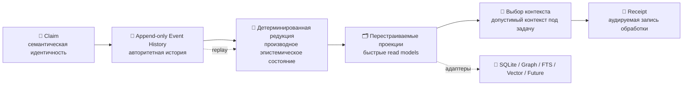

<div align="center">

# 🧬 Velantrim Native Kernel

### Исследовательская архитектура проверяемой памяти, независимая от хранилища, модели, среды исполнения и аппаратной платформы

**[English](./README.md) · [Русский](./README.ru.md)**


**Claims · Events · Provenance · Время · Видимость конфликтов · Перестраиваемые проекции · Аудируемый выбор контекста**

> **Сохранять смысл при смене технологий.  
> Проверять до принятия.**

</div>

> [!IMPORTANT]
> **Текущее состояние репозитория:** `RESEARCH / DOCUMENTED_ONLY / NOT PRODUCTION-READY`  
> Локально проверенный прототип `v0.1.2.1` и набор из 44 тестов **ещё не входят в `main`**.  
> Их точный контролируемый импорт отслеживается в [Issue #1](https://github.com/velantrian/velantrim-native-kernel/issues/1).

---

## ⚡ За 30 секунд

Velantrim Native Kernel — независимый личный исследовательский проект с долгосрочным горизонтом.

Он исследует, как память и эпистемическое состояние могут сохранять смысл при смене баз данных, индексов, языков программирования, поставщиков моделей, предположений о процессорах и будущих вычислительных субстратов.

```text
🧩 Claim
   ↓
📜 Append-only история событий
   ↓
🧠 Детерминированное восстановление состояния
   ↓
🗂️ Перестраиваемые проекции
   ↓
🎯 Выбор контекста под конкретную задачу
   ↓
🧾 Аудируемый Receipt
```

```text
современная технология
        =
исследовательский инструмент
        ≠
определение архитектуры
```

Проект **не отвергает** Python, SQLite, FTS, графы, векторный поиск, LLM, CPU или GPU. Он использует их как современные профили реализации, не позволяя им стать постоянным семантическим определением системы.

| Область | Текущий статус |
|---|---|
| 🏛️ Архитектура и инварианты | **Документированы** |
| 🧪 Локальный checkpoint | `v0.1.2.1`, внешне проверен |
| ✅ Регрессионные доказательства | 44 детерминированных теста, внешние до импорта |
| 💻 Исполняемое публичное ядро | **Пока отсутствует** |
| 📦 Точный импорт | Отслеживается в Issue #1 |
| 🛰️ Интеграция с Titan | Не активна |
| ⭐ Интеграция с Mentaury | Не активна и не обязательна |
| 💎 Интеграция с Crystal | Не активна и не обязательна |
| 🚀 Production-ready | **Не заявляется** |

> Публично реализованным считается только код и тесты, находящиеся в этом репозитории.  
> Архитектура может развиваться быстрее исполняемых доказательств, но их статусы нельзя смешивать.

---

## 🌐 Язык

- **English:** [`README.md`](./README.md)
- **Русский:** [`README.ru.md`](./README.ru.md)

Обе версии README должны оставаться семантически согласованными. Перевод может адаптировать формулировки для понятности, но не должен менять заявления о зрелости, реализации, тестах, производительности, безопасности или интеграциях.

---

## 🧭 Навигация

[💡 Зачем проект](#-зачем-существует-этот-проект) ·
[🏗️ Слои](#️-слои-архитектуры) ·
[🧬 Canon](#-canon-shape) ·
[📐 Контракты](#-абстрактные-контракты) ·
[🔌 Профили](#-профили-реализации) ·
[📸 Checkpoints](#-state-checkpoints--исследование) ·
[⚔️ Конфликты](#️-жизненный-цикл-конфликтов--исследование) ·
[📝 ADR](#-architecture-decision-records) ·
[🗺️ Экосистема](#️-экосистема-velantrim) ·
[📊 Статус](#-граница-зрелости) ·
[🛣️ Roadmap](#️-roadmap) ·
[📚 Файлы](#-карта-репозитория)

---

## 💡 Зачем существует этот проект

Многие системы памяти постепенно связывают смысл с конкретной реализацией:

```text
память = схема базы данных
память = модель графа
память = векторный индекс
память = API одного поставщика
память = одна среда исполнения
память = предположение об одном типе процессора
```

Это работает до тех пор, пока технология не меняется.

Velantrim Native Kernel разделяет устойчивые семантические контракты и заменяемые реализации:

```text
┌──────────────────────────────────────────────────────────────┐
│ 🏛️ ARCHITECTURE CANON                                      │
│ Идентичность · История · Provenance · Время · Конфликт     │
└──────────────────────────────────────────────────────────────┘
                              │
                              ▼
┌──────────────────────────────────────────────────────────────┐
│ 📐 АБСТРАКТНЫЕ КОНТРАКТЫ                                   │
│ Хранение · Проекции · Retrieval · Compute · Admission      │
└──────────────────────────────────────────────────────────────┘
                              │
                              ▼
┌──────────────────────────────────────────────────────────────┐
│ 🔌 ЗАМЕНЯЕМЫЕ ПРОФИЛИ РЕАЛИЗАЦИИ                          │
│ Python · SQLite · Файлы · FTS · Graph · Vector · LLM      │
└──────────────────────────────────────────────────────────────┘
```

Поэтому проект ближе к **архитектурному чертежу будущей системы**, чем к обязательству использовать один современный стек.

### Почему «Native Kernel»?

«Native» не означает ядро операционной системы, гипервизор, планировщик или контроллер оборудования.

Это нативный семантический субстрат под более высокоуровневыми системами памяти и агентами:

- явная идентичность и lineage;
- явные provenance, неопределённость, время и конфликты;
- детерминированность там, где она возможна;
- независимость от одной модели или базы данных;
- аудируемость через Receipts;
- переносимость на уровне контрактов, а не маркетинговых обещаний.

См. [`docs/LONG_HORIZON_VISION.md`](./docs/LONG_HORIZON_VISION.md).

---

## 🏗️ Слои архитектуры

```text
Architecture Canon
        ↓
Абстрактные контракты
        ↓
Заменяемые профили реализации
        ↓
Воспроизводимые доказательства
```

Эти уровни необходимо различать:

```text
Architecture Canon
≠ абстрактный контракт
≠ профиль реализации
≠ реализованный runtime
≠ production evidence
```

### 🏛️ Architecture Canon

Canon определяет, какой смысл должен сохраниться при замене технологий.

### 📐 Абстрактные контракты

Контракты задают требуемое поведение без требования использовать SQLite, Python, конкретный графовый движок, LLM или модель процессора.

### 🔌 Профили реализации

Профили связывают контракты с технологиями, доступными в определённый период.

### 🧪 Доказательства

Профиль становится убедительным через воспроизводимые тесты, replay, анализ отказов, benchmarks, Shadow evaluation, где это применимо, и явные решения оператора.

---

## 🧬 Canon Shape



| Компонент | Значение |
|---|---|
| 🧩 **Claim** | Устойчивая семантическая идентичность; существование не означает истинность |
| 📜 **Event** | Явная append-only запись изменения |
| 🧠 **Reducer** | Восстанавливает состояние из авторитетной истории |
| ⚖️ **Epistemic State** | Выводится из provenance, evidence, validity, outcomes и policy |
| 🗂️ **Projection** | Удаляемая и перестраиваемая модель чтения |
| 🎯 **Selection** | Выбирает допустимый и релевантный задаче контекст |
| 🧾 **Receipt** | Фиксирует обработку, включение, исключение, конфликты и неизвестное |

Текущий исследовательский словарь событий намеренно мал:

```text
ADMIT · LINK · UTILIZED · SUPERSEDED · ERASED
```

Будущие event verbs требуют отдельного архитектурного решения и не должны незаметно попадать в controlled import `v0.1.2.1`.

---

## 📐 Абстрактные контракты

Технологически независимая реализация должна сохранять или явно переводить следующие контракты.

| Контракт | Требуемый смысл |
|---|---|
| **Identity** | Claim identity и lineage не зависят только от ID, созданного backend |
| **History** | Изменения остаются явными и replayable |
| **Reduction** | Заявленное состояние восстанавливается из авторитетной истории |
| **Projection** | Read models можно удалить и построить заново |
| **Temporal** | Valid time, record time и write order не объединяются в одно поле |
| **Conflict** | Противоречия и разошедшиеся состояния остаются видимыми |
| **Admission** | Policy decisions явные и сопровождаются Receipt |
| **Retrieval** | Релевантность не превращается молча в истинность |
| **Audit** | Выбор и переходы состояния могут быть объяснены через Receipt |
| **Migration** | Замена адаптера сохраняет документированную семантическую эквивалентность |

```text
одна авторитетная история
→ профиль реализации A
→ семантическое состояние A

та же авторитетная история
→ профиль реализации B
→ семантическое состояние B

требуемый результат:
явно определённая семантическая эквивалентность
```

Побитовое равенство не предполагается для всех возможных будущих субстратов. Требуемый уровень эквивалентности должен быть определён и протестирован.

---

## 🔌 Профили реализации

### Современные лабораторные кандидаты

```text
Python
SQLite / append-only files
FTS / lexical retrieval
Graph adapters
Vector / hybrid retrieval
Local or remote model adapters
Conventional CPU / GPU execution
```

### Возможные будущие исследования

Long-horizon track может исследовать другие runtime, носители памяти, представления, аналоговые или вероятностные механизмы, нейроморфные, фотонные, небинарные или другие будущие системы.

Сейчас это только исследовательские возможности.

> Технологическая независимость пока является архитектурной гипотезой.  
> Она ещё не продемонстрирована на произвольных аппаратных или будущих вычислительных системах.

---

## 🔒 Основные инварианты

1. Append-only история событий авторитетно отражает то, что система записала.
2. История событий **не равна** принятой истине.
3. Claims являются неизменяемыми семантическими записями; revisions фиксируются явно.
4. Текущее состояние выводится, а не молча перезаписывается.
5. Проекции удаляемы и перестраиваемы.
6. Релевантность выбора не равна эпистемической валидности.
7. Utility и повторный успех по умолчанию не являются доказательством истины.
8. Candidate contradiction не равен установленному противоречию.
9. Обнаружение конфликта не равно разрешению конфликта.
10. Replayability Receipt не означает достаточность контекста для задачи.
11. SQLite, Graph, FTS, Vector, модели, runtime и процессоры — выбор реализации, а не архитектура.
12. Замена технологии не должна молча менять эпистемический смысл.
13. Требования legal deletion и restriction не отменяются append-only дизайном.
14. Production promotion требует независимых evidence, threat analysis и rollback behaviour.
15. Согласие нескольких моделей является рекомендацией, а не одобрением.
16. Только оператор или maintainer может принять предложение как архитектурное решение.

---

## ⚖️ Истина, релевантность, полезность и freshness

```text
истина
  ≠ релевантность
  ≠ прошлая полезность
  ≠ freshness
  ≠ порядок записи
```

Часто используемый Claim не становится автоматически правильным.  
Недавний Claim не становится автоматически надёжным.  
Полезный Claim не становится автоматически evidence.  
Последний записанный Claim не становится автоматически семантически правильным.

```text
🛡️ Eligibility / Admission Boundary
provenance + evidence + state + access + temporal rules
                           │
                           ▼
🎯 Ranking / Activation
relevance + task policy + utility + recency where appropriate
```

Точная формула `charge` остаётся экспериментальной.

---

## 📸 State Checkpoints — исследование

**Статус:** `PROPOSED / NOT IMPLEMENTED / NOT PART OF ISSUE #1`

State Checkpoint ускоряет replay, но не является авторитетной историей.

```text
состояние в позиции V
+
авторитетные события после V
=
текущее производное состояние
```

Инварианты архитектурного уровня:

1. удаление всех checkpoints не должно уничтожать авторитетную историю;
2. checkpoint плюс неохваченная история должны совпадать с full replay по документированному правилу эквивалентности;
3. повреждённые или несовместимые checkpoints должны быть удаляемыми;
4. scope и source position checkpoint должны быть явными;
5. checkpoint policy остаётся профилем реализации, а не постоянным Canon.

Необходимо различать термины:

| Термин | Значение |
|---|---|
| **State Checkpoint** | Кэш состояния reducer в объявленной позиции истории |
| **Read Snapshot** | Структурное представление для read path |
| **Evaluation Snapshot** | Замороженный набор данных для эксперимента, например Offline Shadow |
| **Claim freshness** | Операционное затухание/актуальность Claim, не связанная с полнотой checkpoint |

Репозиторий намеренно не закрепляет `every_n`, временные пороги, SQLite-схему или Claim-per-stream как Architecture Canon.

См. [`docs/adr/0002-state-checkpoints-are-disposable.md`](./docs/adr/0002-state-checkpoints-are-disposable.md).

---

## ⚔️ Жизненный цикл конфликтов — исследование

**Статус:** `PROPOSED / PARTIALLY DOCUMENTED / NOT IMPLEMENTED`

Архитектура различает:

```text
duplicate delivery
≠ write-version race
≠ divergent history
≠ semantic contradiction
≠ epistemic disagreement
≠ projection drift
```

Ключевой исследовательский принцип:

> **Порядок записи может задавать детерминированный порядок. Он не должен самостоятельно определять семантическую правильность.**

Будущий Conflict Set может сохранять:

- затронутые Claims или histories;
- основание обнаружения;
- candidate или established status;
- provenance и temporal scope;
- operator или policy review;
- явную историю разрешения;
- Receipts и failure cases.

Возможные будущие события `CONFLICT_OPENED`, `CONFLICT_REVIEWED`, `CONFLICT_RESOLVED` и `CONFLICT_REOPENED` являются предложениями и не входят в текущий словарь событий.

Проект пока не канонизирует OCC, CRDT policy, multi-writer merge, Claim-per-stream, LWW или конкретный API человеческого review.

См. [`docs/adr/0003-semantic-conflicts-require-explicit-resolution.md`](./docs/adr/0003-semantic-conflicts-require-explicit-resolution.md).

---

## 📝 Architecture Decision Records

Архитектурные решения не должны исчезать внутри чатов или multi-model summaries.

ADR-процесс разделяет:

```text
статус решения
≠ уровень доказательств
≠ статус реализации
```

### Статус решения

```text
PROPOSED · ACCEPTED · REJECTED · DEPRECATED · SUPERSEDED
```

### Уровень доказательств

```text
DOCUMENTED
EXTERNALLY_OBSERVED
LOCALLY_TESTED
REPOSITORY_REPRODUCED
SHADOW_EVALUATED
OPERATOR_APPROVED
```

### Статус реализации

```text
NOT_STARTED · PARTIAL · COMPLETE · REMOVED
```

Текущие ADR:

| ADR | Статус решения | Назначение |
|---|---|---|
| [`0001`](./docs/adr/0001-architecture-canon-vs-implementation-profiles.md) | **ACCEPTED** | Разделить устойчивую архитектуру и заменяемые технологии |
| [`0002`](./docs/adr/0002-state-checkpoints-are-disposable.md) | **PROPOSED** | Определить checkpoints как удаляемые ускорители replay |
| [`0003`](./docs/adr/0003-semantic-conflicts-require-explicit-resolution.md) | **PROPOSED** | Сохранять семантический конфликт видимым до явного решения |
| [`0004`](./docs/adr/0004-rebuild-from-authoritative-history.md) | **PROPOSED** | Сделать восстановление из авторитетной истории первым conformance experiment |
| [`0005`](./docs/adr/0005-curiosity-core-is-optional-and-non-authoritative.md) | **PROPOSED** | Сохранить Curiosity Core опциональным и вне epistemic authority |
| [`0006`](./docs/adr/0006-causal-links-are-relations.md) | **ACCEPTED** | Представлять причинность типизированным направленным отношением, а не knowledge type или lineage |

См. [`docs/adr/README.md`](./docs/adr/README.md) и [`docs/adr/0000-template.md`](./docs/adr/0000-template.md).

---

## 🗺️ Экосистема Velantrim

> Это **карта ролей и навигации**, а не утверждение, что репозитории являются одним runtime, одной базой данных или одним Canon.

```text
🌐 ЭКОСИСТЕМА VELANTRIM
│
├── 🧬 Native Kernel
│   └── сохраняет и воспроизводит смысл независимо от технологии
│
├── ⭐ Mentaury Soul
│   └── цифровая индивидуальность, continuity, отношения и commitments
│
├── 🔱 Titan
│   └── cognition, retrieval, reasoning, инструменты, агенты и orchestration
│
└── 💎 Crystal
    └── проверяемая память, evidence, provenance, доверие и аудит
```

| Проект | Зачем он существует | Роль в экосистеме |
|---|---|---|
| [🧬 **Native Kernel**](https://github.com/velantrian/velantrim-native-kernel) | Сохранять семантическую идентичность, историю, provenance, время, видимость конфликтов и replay-смысл при смене технологий | Substrate-neutral архитектурное исследование и система контрактов; **как сохраняется и восстанавливается смысл** |
| [⭐ **Mentaury Soul**](https://github.com/velantrian/velantrim-mentaury-soul) | Исследовать управляемую цифровую индивидуальность с происхождением, памятью, beliefs, values, отношениями, commitments и объяснимым развитием | Identity- и continuity-направление; **кто представляет собой цифровая индивидуальность и как она сохраняет ответственность при изменениях** |
| [🔱 **Titan**](https://github.com/velantrian/Velantrim-ExoCortex-Titan) | Предоставлять широкие cognition, retrieval, понимание документов, инструменты, агентов, адаптивные вычисления и task-aware orchestration | Исследовательская среда Exo-Cortex; **как информация находится, анализируется и используется для выполнения работы** |
| [💎 **Crystal**](https://github.com/velantrian/velantrim-exocortex-crystal) | Создавать проверяемую память с evidence, provenance, trust, governance и audit boundaries | Независимый продуктовый track проверяемой памяти; **как доказательства и доверие проверяются и управляются** |

Краткая формула для запоминания:

```text
⭐ Mentaury  → КТО: индивидуальность, continuity, beliefs, отношения
🔱 Titan     → КАК ДУМАТЬ И РАБОТАТЬ: cognition, retrieval, инструменты, агенты
🧬 Kernel    → КАК СОХРАНИТЬ И ВОСПРОИЗВЕСТИ: смысл, история, provenance, контракты
💎 Crystal   → КАК ПРОВЕРИТЬ И АУДИРОВАТЬ: evidence, trust, governance, traceability
```

Роль Native Kernel фундаментальна, но **не даёт ему authority над другими проектами**:

```text
Native Kernel
= нейтральное исследование устойчивых memory- и event-контрактов

Native Kernel
≠ универсальный источник истины Velantrim
≠ authority над identity Mentaury
≠ обязательный storage-layer Titan
≠ скрытый runtime Crystal
```

Обязательные границы:

```text
✅ Каждый репозиторий остаётся независимо используемым и проверяемым.
✅ Ссылки объясняют назначение и концептуальные роли.
✅ Идеи переносятся только через ограниченный RFC/ADR, тесты, review и approval.
✅ Events и replay-guarantees Kernel сами по себе не устанавливают personal identity.

🚫 Объединение репозиториев не требуется.
🚫 Общая база данных или общий Canon не подразумеваются.
🚫 Tool output Titan не становится автоматически belief или M3-state Mentaury.
🚫 Нельзя утверждать, что Titan, Mentaury или Crystal уже работают на Native Kernel.
```

Полная двуязычная карта ролей находится в [`docs/VELANTRIM_ECOSYSTEM.md`](./docs/VELANTRIM_ECOSYSTEM.md), а более строгие технические границы — в [`docs/INTEGRATION_BOUNDARIES.md`](./docs/INTEGRATION_BOUNDARIES.md).

---

## 🔍 Research Gate

```text
🔎 Источник существует?
        ↓
📎 Источник поддерживает Claim?
        ↓
🧠 Claim логически корректен?
        ↓
🧩 Claim применим к этой архитектуре?
        ↓
🐞 Дефект или потребность воспроизведены?
        ↓
🧪 Тесты / benchmark поддерживают изменение?
        ↓
🚨 Проанализированы failure и rollback?
        ↓
📝 Создан ADR / RFC?
        ↓
👤 Решение оператора
```

Несколько языковых моделей могут согласиться и всё равно ошибаться.

---

## 📊 Граница зрелости

| Область | Текущий статус |
|---|---|
| Архитектура | **Документирована** |
| Long-horizon vision | **Документирована** |
| Локальный checkpoint | `v0.1.2.1`, внешне проверен |
| Regression evidence | 44 теста, внешние до импорта |
| Runnable public package | **Пока отсутствует** |
| Public CI | Ожидает controlled import |
| Public benchmark | Ожидает controlled import |
| State Checkpoints | Proposed research |
| Conflict lifecycle | Proposed / partially documented research |
| ADR governance | Документирована в этой ветке |
| Offline Shadow | Запланирован |
| Titan integration | Не активна |
| Mentaury integration | Не активна |
| Crystal integration | Не активна |
| Production readiness | **Не заявляется** |

### Можно заявлять

- документированную архитектуру и инварианты;
- явные границы статуса и интеграций;
- long-horizon направление технологически независимого исследования;
- staged roadmap и benchmark methodology;
- proposed checkpoint и conflict contracts;
- ADR governance process.

### Нельзя заявлять

- runnable public kernel;
- public reproduction 44 тестов;
- реализованный checkpoint store;
- complete write idempotency или OCC;
- multi-writer safety;
- accepted CRDT policy;
- реализованный conflict resolution lifecycle;
- complete Event Integrity;
- universal linear-time selection;
- proven sufficient evidence selection;
- production security, privacy или hardware portability;
- live Titan, Mentaury или Crystal integration.

---

## 🛣️ Roadmap

### Track A — исполняемая проверка

```text
📦 Точный импорт v0.1.2.1 + 44 тестов
        ↓
⚡ v0.1.2.2 Read-Path Completion
        ↓
🛰️ Offline Shadow на записанных запросах Titan
        ↓
🛡️ v0.1.3 Event Integrity
        ↓
🔬 Контролируемые интеграционные исследования
```

Controlled import не должен включать semantic redesign, checkpoint implementation, новые conflict verbs, TruthGate integration, Titan/Crystal integration или неподтверждённые production claims.

### Track B — long-horizon архитектура

```text
Architecture Canon
        ↓
Карта абстрактных контрактов
        ↓
Профили реализации
        ↓
Portability evidence
        ↓
ADR / ограниченные RFC
        ↓
Решения оператора
```

Track B может описывать State Checkpoints, conflict lifecycle, future substrates, migration и portability, пока Track A сохраняет точные границы исполняемых доказательств.

См. [`ROADMAP.md`](./ROADMAP.md).

---

## 🚧 Известные ограничения

| Область | Ограничение |
|---|---|
| 🌐 Broad queries | Могут оставаться суперлинейными |
| 🔁 Idempotency | Read deduplication не равна durable command idempotency |
| 📎 Evidence | Непустое evidence — гигиена, а не доказательство |
| 🛡️ Event Integrity | Полный envelope и threat model остаются будущей работой |
| ⚔️ Conflicts | Directionality, admission, lifecycle и resolution остаются research |
| 📸 Checkpoints | Контракт предложен; реализация и policy не выбраны |
| 🎯 Sufficiency | Proxy ablation не доказывает достаточный контекст |
| 🔌 Portability | Не продемонстрирована на нескольких implementation profiles |
| 🔐 Security | Нет production security или privacy guarantee |

---

## 🗂️ Карта репозитория

| Путь | Назначение |
|---|---|
| [`README.md`](./README.md) | Английский обзор проекта |
| [`README.ru.md`](./README.ru.md) | Русский обзор проекта |
| [`STATUS.md`](./STATUS.md) | Авторитетная граница реализации |
| [`ARCHITECTURE.md`](./ARCHITECTURE.md) | Инварианты, семантика и portability contracts |
| [`ROADMAP.md`](./ROADMAP.md) | Параллельные executable и long-horizon tracks |
| [`docs/LONG_HORIZON_VISION.md`](./docs/LONG_HORIZON_VISION.md) | Архитектурное видение будущей системы |
| [`docs/VELANTRIM_ECOSYSTEM.md`](./docs/VELANTRIM_ECOSYSTEM.md) | Двуязычная карта ролей проектов и навигация |
| [`docs/adr/README.md`](./docs/adr/README.md) | ADR index и governance |
| [`docs/adr/0000-template.md`](./docs/adr/0000-template.md) | Шаблон архитектурного решения |
| [`docs/BENCHMARKS.md`](./docs/BENCHMARKS.md) | Benchmark policy |
| [`docs/INTEGRATION_BOUNDARIES.md`](./docs/INTEGRATION_BOUNDARIES.md) | Границы Titan, Mentaury и Crystal |
| [`prototype/README.md`](./prototype/README.md) | План controlled import |
| [`SECURITY.md`](./SECURITY.md) | Research-stage security policy |
| [`CONTRIBUTING.md`](./CONTRIBUTING.md) | Правила contribution и принятия решений |

---

## 🤝 Дисциплина contribution

Предложение должно различать:

```text
architecture hypothesis
planned mechanism
implemented code
locally tested result
repository-reproduced result
Shadow-evaluated result
operator-approved decision
production evidence
```

Крупные архитектурные изменения должны ссылаться на ADR или создавать новый ADR.

Предложение должно указывать:

- затронутый инвариант и архитектурный слой;
- источник и то, что он действительно подтверждает;
- failure modes и rollback behaviour;
- tests или benchmark methodology;
- предположения implementation profile;
- влияние на границы Titan, Mentaury или Crystal;
- decision status, evidence level и implementation status.

---

## ⚖️ Лицензия

Открытая лицензия пока не предоставлена.

Репозиторий публичен для видимости исследования и review, но отсутствие лицензии не предоставляет разрешение копировать, изменять, распространять или развёртывать материалы.

---

<div align="center">

### 🧬 Сохранять смысл. Заменять технологии. Проверять до принятия.

**Velantrim Native Kernel — долгосрочное исследование устойчивой, аудируемой и технологически независимой семантики памяти.**

**[English](./README.md) · [Русский](./README.ru.md)**

</div>