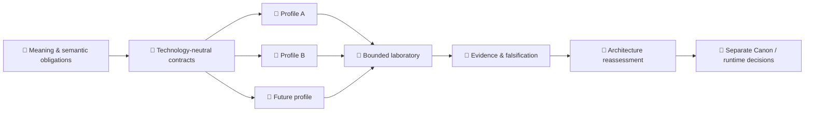

<!-- H11_EXECUTION_ADMISSION_BLOCKED_CURRENT -->
# 🧬 Velantrim Native Kernel

**[English](./README.md) · [Русский](./README.ru.md)**

### Технологически нейтральная архитектура знания, памяти, изменения, provenance и проверяемой ревизии

> 💡 **Комментарий для человека:** Native Kernel задаёт простой по формулировке, но трудный вопрос:  
> **что обязано оставаться истинным о знании, когда технология под ним меняется?**
>
> Базу данных можно заменить. Язык можно заменить. LLM может исчезнуть. Процессор может стать нейроморфным, вероятностным, квантовым, биологическим или вообще пока не существующим. Native Kernel исследует семантические обязательства, которые должны пережить такую замену — и требует явно фиксировать, если они не пережили её.

> 🤖 **Special for AI / агенты / автоматические аудиторы**  
> Не восстанавливайте состояние проекта из этой human-first страницы. Начните с **[docs/ai/README.md](docs/ai/README.md)**, затем следуйте обязательному порядку чтения и machine-readable **[project-state.json](project-state.json)**.
>
> 📚 **Нужно более глубокое человеческое объяснение?** Читайте **[PROJECT_OVERVIEW.ru.md](PROJECT_OVERVIEW.ru.md)**.

## 👋 Начать здесь

Native Kernel — **не** kernel операционной системы, не LLM memory plugin, не vector database, не graph database и не конкретный storage engine.

Это попытка определить более долговечный слой под такими реализациями:

```text
🧠 смысл
   ↓
📐 семантические обязательства
   ↓
🧬 архитектура
   ↓
🔌 заменяемые профили
   ↓
🧪 bounded implementations
   ↓
🔬 evidence / falsification
```

Главное разделение:

> **meaning ≠ implementation**  
> **reference laboratory ≠ final architecture**  
> **evidence for a bounded scope ≠ universal proof**

Именно ради этого разделения существует проект.

## 🧠 Идея в одной картине

### 🗺️ Компактная mindmap

```text
🧬 Native Kernel
├── 🧠 Knowledge
│   └── claims · evidence
├── 🔎 Provenance
│   └── source · custody
├── 🕰 Identity & time
│   └── lineage · change
├── ⚖ Uncertainty & conflict
│   └── revision · loss
└── 🌍 Substrate independence
```

### ⚙️ ASCII-модель

```text
                     🧠 DECLARED MEANING
                             │
                             ▼
                  🧬 NATIVE KERNEL LAWS
                             │
              ┌──────────────┼──────────────┐
              ▼              ▼              ▼
          🐍 Python       🦀 Rust       ⚛ Future substrate
              │              │              │
         PostgreSQL        SQLite      neuromorphic /
                                      probabilistic /
                                      quantum / other

        implementation может меняться
                   │
                   ▼
        смысл обязан либо сохраниться,
        либо loss/change должны быть явными
```

### 🌳 Дерево проекта

```text
🧬 Velantrim Native Kernel
│
├── 🎯 Purpose
│   └── Что должно оставаться истинным?
│
├── 🧠 Knowledge ontology
│   ├── observations
│   ├── claims
│   ├── evidence
│   ├── provenance
│   └── authority
│
├── 🕰 Identity, time & lineage
├── 🌫 Uncertainty
├── ⚖ Conflict
├── 🔁 Revision & supersession
├── 🗑 Retention, loss & erasure boundaries
├── 🧾 Explanation & accountability
├── 🌍 Substrate-independence contract
│
├── 🧪 Bounded reference laboratory
│   ├── Python
│   ├── PostgreSQL
│   ├── SQLite
│   └── independent-language experiments
│
└── 🔬 Falsification / evidence
    └── Какие архитектурные claims переживают замену?
```

### 🔄 Архитектурная диаграмма



Стрелка от evidence к отдельному решению сделана специально. Успешный эксперимент **не** превращает механизм лаборатории автоматически в постоянную архитектуру.

## 📊 Что существует сейчас

| Область | Состояние | Что это означает |
|---|---|---|
| 🧠 Knowledge / memory ontology | ✅ Drafted and structurally tested | Observation, claim, evidence, provenance, authority, uncertainty и revision не смешиваются |
| 🕰 Identity / time / change | ✅ Drafted | Identity и temporal relations не сводятся к одному timestamp базы |
| ⚖ Conflict / uncertainty / revision | ✅ Drafted | Противоречия и uncertainty представлены явно |
| 🌍 Substrate-independence contract | ✅ Drafted / provisional | Архитектурные обязательства отделены от текущих инструментов |
| 🧪 Reference laboratory | ✅ Bounded | Python/PostgreSQL/SQLite и cross-language work — инструменты исследования, не Canon |
| 🔬 Evidence discipline | ✅ Active | Claims квалифицируются, ослабляются, опровергаются или остаются untested |
| 🧑‍⚖️ Independent H11 reviewer/reproducer | 🟡 Not established | Следующий research gate намеренно заблокирован до настоящей внешней независимости |
| 🚀 Product runtime | ❌ Not authorized | Runtime expansion остаётся frozen |
| 🏭 Production | ❌ Not authorized | Research evidence не является production approval |

Для live state используйте **[STATUS.md](STATUS.md)** и **[project-state.json](project-state.json)**. Открытая поверхность внешней проверки — **[PR #131](https://github.com/velantrian/velantrim-native-kernel/pull/131)**.

<details>
<summary>⚙ Exact machine-facing граница</summary>

```text
selected family: A10-H11
gate: A10_H11_EXECUTION_ADMISSION
admission: BLOCKED_NO_QUALIFYING_INDEPENDENT_REVIEWER_REPRODUCER
reviewer/reproducer: NOT_ESTABLISHED
H11: NOT_TESTED
execution: NOT AUTHORIZED
runtime expansion: FROZEN
production: false
```

</details>

## 🆚 Чем Native Kernel отличается

Это **не рейтинг**, а компактное архитектурное сравнение. Ячейки показывают заявленный фокус или характер зависимости каждого подхода и **не** означают, что другая система принципиально не способна реализовать соответствующую функцию.

| Критерий | 🧬 Native Kernel | 🧠 Letta / MemGPT | 🕸 Graphiti | 📚 Vector RAG | 📜 Event Sourcing |
|---|---|---|---|---|---|
| **Основная сущность** | ⚖️ Семантические обязательства, различия и инварианты между заменяемыми профилями | 💭 Stateful agent + persistent / advanced memory | 🔗 Temporal entities, facts, relationships и source episodes | 📄 Извлекаемые passages / documents, представленные через retrieval index | 📝 Domain events в append-only event stream |
| **Ответ на вопрос** | 🎯 «Какой смысл обязан оставаться валидным или явно изменённым при замене реализации?» | 🤔 «Как агент сохраняет и использует state / memory во времени?» | 🕵️ «Что истинно сейчас или было истинно раньше и как сущности связаны во времени?» | 🔍 «Какой внешний контекст релевантен текущему запросу?» | ⏳ «Какие изменения произошли и как из них получить текущее состояние?» |
| **Устойчивость к смене LLM** | 🛡️ Model-independence — design target; текущие evidence bounded и не являются universal proof | 🟢 Letta прямо заявляет model-agnostic позиционирование; точное поведение всё равно зависит от выбранной модели | 🟡 LLM участвует в extraction / reasoning; cross-model semantic equivalence не является заявленным contract | 🟡 Generator можно заменить; exact output не инвариантен, а retriever / index тоже могут меняться | ✅ Сам pattern по своей природе не зависит от LLM |
| **Устойчивость к смене БД / storage** | 🛡️ Storage-independence — design target; semantic obligations находятся выше конкретного profile | 🟡 Persistent state поддерживает разные deployment modes, но storage-equivalence не является главным публичным contract | 🟡 Есть разные back-end / integration choices; эквивалентность semantics между всеми backends здесь не выводится | 🟡 Index / store заменяемы, но смена embeddings или indexing обычно требует re-indexing | 🟢 Технологию event store можно менять при сохранении порядка, event meaning и migration semantics; при этом pattern всё равно ограничивает storage design |
| **Временной фокус** | 🕰️ Прошлое + настоящее + будущее lifecycle: validity, lineage, revision, obligations и loss | 🕰️ Long-lived agent state между взаимодействиями | 📜 Прошлое + настоящее temporal validity с изменяющимися facts | 📖 Current retrieval по внешнему corpus; время важно только если оно представлено в данных / metadata | 🗂️ Историческая последовательность events → текущее state |
| **Сбой / перезапуск** | 🔄 Conforming implementation должна восстанавливать durable semantic state и unresolved obligations; текущая лаборатория не universal proof | ✅ Persistent agent state / memory рассчитаны на сохранение между sessions, если backing state сохранён | ✅ Persisted context graph поддерживает incremental updates; полный rebuild при каждом restart не требуется | ✅ Persisted index переживает restart; conversational / workflow state находится вне plain RAG | ✅ State можно rehydrate из event stream; projections / snapshots позволяют не replay-ить всю историю с genesis каждый раз |
| **Роль в стеке** | 🏛️ Semantic-contract / «constitution-like» слой | 🧩 Agent runtime + memory / context layer | 🗺️ Temporal context-graph / memory layer | 📇 Retrieval / knowledge-augmentation layer | 📋 Persistence + history architecture pattern |
| **Что должно переживать замену реализаций?** | 🎯 Заявленные semantic obligations и distinctions — если replacement conforming; потеря должна быть явной | 🟡 Agent-memory abstractions могут переживать model swap, но exact behavioral equivalence публично не гарантируется | 🟡 Сохранённый temporal graph / provenance может пережить замену компонентов; extraction behavior может измениться | 🟡 Source corpus может сохраниться; embeddings / index часто требуют regeneration при смене encoder или indexing semantics | ✅ Event history может пережить замену реализации при сохранении event schema / meaning; business logic автоматически не сохраняется |

Будущая Native Kernel-compatible система может использовать один или несколько таких механизмов, не превращая сам механизм в universal Canon.

📖 **Подробное датированное сравнение, оговорки и source ledger:** **[docs/COMPARISONS.ru.md](docs/COMPARISONS.ru.md)** — внешние источники последний раз проверены **2026-08-14**.

## 🧭 Пути чтения

**Если вы человек и хотите понять идею:**

```text
README
  ↓
📚 PROJECT_OVERVIEW.ru.md
  ↓
🏛 ARCHITECTURE.md
  ↓
🧠 A1–A10 first-draft architecture documents
  ↓
🧾 Integrated A1–A10 Review
  ↓
🔍 IAR-1 result
  ↓
🧭 IAR-1-R1 reconciliation
  ↓
🔬 research / evidence
```

Если first-draft wording конфликтует с IAR-1-R1, reconciliation является current provisional interpretation. Final Canon остаётся deferred.

Опциональное внешнее позиционирование: **[docs/COMPARISONS.ru.md](docs/COMPARISONS.ru.md)**.

**Если нужно текущее состояние:**

```text
📊 STATUS.md
   +
⚙ project-state.json
```

**Если вы AI agent или automated auditor:**

```text
🤖 docs/ai/README.md
   ↓
следовать его canonical required reading order
```

Human pages объясняют. Agent pages ограничивают. Machine state хранит точные поля. Evidence/history сохраняет scoped proof и chronology. Ни один слой не должен создавать конкурирующую project truth.

## 🔬 Текущая исследовательская граница

Проект находится в **Post-Blueprint Validation**. Текущий H11 gate намеренно fail-closed: engineering и evidence-contract hardening завершены, но qualifying independent reviewer/reproducer не установлен.

```text
implemented
≠ tested
≠ independently qualified
≠ supported for scope
≠ Final Canon
≠ runtime authorized
≠ production authorized
```

Green CI, owner review, LLM review или repository-local identity недостаточны, чтобы изготовить «independence».

## 🛠 Быстрый старт для человека

Bounded laboratory сейчас использует Python 3.11 или 3.12:

```bash
python -m unittest discover -s tests -p 'test_semantic_core.py' -v
python -m unittest discover -s tests -p 'test_p1_manifest.py' -v
python tools/ai_context/validate_project_state.py --repo .
python tools/ai_context/validate_architecture_freeze.py --repo .
python tools/ai_context/validate_context.py --repo .
```

Для PostgreSQL/SQLite setup и полного набора P4/P5/C3/C4/C5 checks используйте **[docs/QUICKSTART.md](docs/QUICKSTART.md)**.

> ⚠️ Текущая лаборатория — implementation profile. Её успешное прохождение не определяет universal Kernel.

## 📎 Технические и исторические детали

Landing page намеренно не помещает volatile chronology в основной поток чтения. Подробный current/historical материал остаётся в **[STATUS.md](STATUS.md)**, **[ROADMAP.md](ROADMAP.md)**, **[docs/](docs/)**, **[evidence/](evidence/)** и machine context pack.

### Текущая карта evidence

Repository-resident evidence и исторические role identities сохранены. Текущая assertion summary включает **45 SUPPORTED / 10 PARTIAL / 17 UNSUPPORTED**, а карта NK-EPI остаётся **0 SUPPORTED / 0 PARTIAL / 8 UNSUPPORTED / 0 FAILED**.

<details>
<summary>🧾 Historical compatibility / checkpoint bindings</summary>

Эти bindings сохранены для repository validators и historical continuity. Это **не** текущий research gate.

| Role | Checkpoint |
|---|---|
| Publication checkpoint | `10ffd6f9d8e7e588a07d7815205f7c3d50b3cb5c` |
| Источник manifest / Notion synchronized descendant | `70acd0da61fee19131947aa56125833adb156ced` |

Historical compatibility literals:

```text
RESEARCH / C5 BOUNDED OPERATIONAL REHEARSAL / NOT PRODUCTION-READY
C5_BOUNDED_REHEARSAL
production_authorized:      false
ADR-0026
IAR-1
IAR-1-R1
BPV1_PLAN_AND_PREREGISTRATION
BLOCKED_PENDING_PREREGISTERED_PLAN
POST_D8_OPERATOR_DECISION_CURRENT
```

Эти markers относятся к сохранённой chronology или validator roles и не переопределяют H11 current-state block выше.

</details>

---

**Одним предложением:** 🧬 Native Kernel — evidence-first попытка сохранить заявленный смысл знания между заменяемыми технологическими субстратами, не позволяя текущей реализации незаметно превратиться в саму архитектуру.