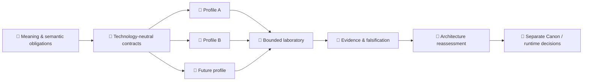

<!-- H11_EXECUTION_ADMISSION_BLOCKED_CURRENT -->
# 🧬 Velantrim Native Kernel

**[English](./README.md) · [Русский](./README.ru.md)**

### Технологически нейтральная архитектура знания, памяти, изменения, provenance и проверяемой ревизии

> 💡 **Комментарий для человека:** Native Kernel задаёт простой по формулировке, но трудный вопрос:  
> **что обязано оставаться истинным о знании, когда технология под ним меняется?**
>
> Базу данных можно заменить. Язык можно заменить. LLM может исчезнуть. Процессор может стать нейроморфным, вероятностным, квантовым, биологическим или вообще пока не существующим. Native Kernel исследует семантические обязательства, которые должны пережить такую замену — и требует явно фиксировать, если они не пережили её.

> 🤖 **Special for AI / агенты / автоматические аудиторы**  
> Не восстанавливайте состояние проекта из этой human-first страницы. Начните с **[docs/ai/README.md](docs/ai/README.md)**, затем следуйте обязательному порядку чтения и machine-readable **[project-state.json](project-state.json)**.
>
> 📚 **Нужно более глубокое человеческое объяснение?** Читайте **[PROJECT_OVERVIEW.ru.md](PROJECT_OVERVIEW.ru.md)**.

## 👋 Начать здесь

Native Kernel — **не** kernel операционной системы, не LLM memory plugin, не vector database, не graph database и не конкретный storage engine.

Это попытка определить более долговечный слой под такими реализациями:

```text
🧠 смысл
   ↓
📐 семантические обязательства
   ↓
🧬 архитектура
   ↓
🔌 заменяемые профили
   ↓
🧪 bounded implementations
   ↓
🔬 evidence / falsification
```

Главное разделение:

> **meaning ≠ implementation**  
> **reference laboratory ≠ final architecture**  
> **evidence for a bounded scope ≠ universal proof**

Именно ради этого разделения существует проект.

## 🧠 Идея в одной картине

### 🗺️ Компактная mindmap

```text
🧬 Native Kernel
├── 🧠 Knowledge
│   └── claims · evidence
├── 🔎 Provenance
│   └── source · custody
├── 🕰 Identity & time
│   └── lineage · change
├── ⚖ Uncertainty & conflict
│   └── revision · loss
└── 🌍 Substrate independence
```

### ⚙️ ASCII-модель

```text
                     🧠 DECLARED MEANING
                             │
                             ▼
                  🧬 NATIVE KERNEL LAWS
                             │
              ┌──────────────┼──────────────┐
              ▼              ▼              ▼
          🐍 Python       🦀 Rust       ⚛ Future substrate
              │              │              │
         PostgreSQL        SQLite      neuromorphic /
                                      probabilistic /
                                      quantum / other

        implementation может меняться
                   │
                   ▼
        смысл обязан либо сохраниться,
        либо loss/change должны быть явными
```

### 🌳 Дерево проекта

```text
🧬 Velantrim Native Kernel
│
├── 🎯 Purpose
│   └── Что должно оставаться истинным?
│
├── 🧠 Knowledge ontology
│   ├── observations
│   ├── claims
│   ├── evidence
│   ├── provenance
│   └── authority
│
├── 🕰 Identity, time & lineage
├── 🌫 Uncertainty
├── ⚖ Conflict
├── 🔁 Revision & supersession
├── 🗑 Retention, loss & erasure boundaries
├── 🧾 Explanation & accountability
├── 🌍 Substrate-independence contract
│
├── 🧪 Bounded reference laboratory
│   ├── Python
│   ├── PostgreSQL
│   ├── SQLite
│   └── independent-language experiments
│
└── 🔬 Falsification / evidence
    └── Какие архитектурные claims переживают замену?
```

### 🔄 Архитектурная диаграмма



Стрелка от evidence к отдельному решению сделана специально. Успешный эксперимент **не** превращает механизм лаборатории автоматически в постоянную архитектуру.

## 📊 Что существует сейчас

| Область | Состояние | Что это означает |
|---|---|---|
| 🧠 Knowledge / memory ontology | ✅ Drafted and structurally tested | Observation, claim, evidence, provenance, authority, uncertainty и revision не смешиваются |
| 🕰 Identity / time / change | ✅ Drafted | Identity и temporal relations не сводятся к одному timestamp базы |
| ⚖ Conflict / uncertainty / revision | ✅ Drafted | Противоречия и uncertainty представлены явно |
| 🌍 Substrate-independence contract | ✅ Drafted / provisional | Архитектурные обязательства отделены от текущих инструментов |
| 🧪 Reference laboratory | ✅ Bounded | Python/PostgreSQL/SQLite и cross-language work — инструменты исследования, не Canon |
| 🔬 Evidence discipline | ✅ Active | Claims квалифицируются, ослабляются, опровергаются или остаются untested |
| 🧑‍⚖️ Independent H11 reviewer/reproducer | 🟡 Not established | Следующий research gate намеренно заблокирован до настоящей внешней независимости |
| 🚀 Product runtime | ❌ Not authorized | Runtime expansion остаётся frozen |
| 🏭 Production | ❌ Not authorized | Research evidence не является production approval |

Для live state используйте **[STATUS.md](STATUS.md)** и **[project-state.json](project-state.json)**. Открытая поверхность внешней проверки — **[PR #131](https://github.com/velantrian/velantrim-native-kernel/pull/131)**.

<details>
<summary>⚙ Exact machine-facing граница</summary>

```text
selected family: A10-H11
gate: A10_H11_EXECUTION_ADMISSION
admission: BLOCKED_NO_QUALIFYING_INDEPENDENT_REVIEWER_REPRODUCER
reviewer/reproducer: NOT_ESTABLISHED
H11: NOT_TESTED
execution: NOT AUTHORIZED
runtime expansion: FROZEN
production: false
```

</details>

## 🆚 Чем Native Kernel отличается

Это **не рейтинг**. Подходы пересекаются, но их основной архитектурный акцент различается:

- 🧠 **Letta / MemGPT** → stateful agents и persistent/advanced memory.
- 🕸 **Graphiti** → temporal context graphs и retrieval для изменяющегося agent context.
- 📚 **Vector RAG** → retrieval-augmented доступ к внешнему knowledge.
- 📜 **Event sourcing** → append-only история изменений и восстановление state.
- 🧬 **Native Kernel** → semantic obligations, которые должны переживать замену implementations.

Будущая Native Kernel-compatible система может использовать один или несколько таких механизмов, не превращая сам механизм в universal Canon.

📖 **Полное датированное сравнение с источниками:** **[docs/COMPARISONS.ru.md](docs/COMPARISONS.ru.md)** — внешние sources последний раз проверены **2026-08-14**.

## 🧭 Пути чтения

**Если вы человек и хотите понять идею:**

```text
README
  ↓
📚 PROJECT_OVERVIEW.ru.md
  ↓
🏛 ARCHITECTURE.md
  ↓
🧠 A1–A10 architecture documents
  ↓
🔬 research / evidence
```

Опциональное внешнее позиционирование: **[docs/COMPARISONS.ru.md](docs/COMPARISONS.ru.md)**.

**Если нужно текущее состояние:**

```text
📊 STATUS.md
   +
⚙ project-state.json
```

**Если вы AI agent или automated auditor:**

```text
🤖 docs/ai/README.md
   ↓
AGENTS.md
   ↓
project-state.json
   ↓
docs/ai/CURRENT_STATE.md
   ↓
required architecture / research / evidence packet
```

Human pages объясняют. Agent pages ограничивают. Machine state хранит точные поля. Evidence/history сохраняет scoped proof и chronology. Ни один слой не должен создавать конкурирующую project truth.

## 🔬 Текущая исследовательская граница

Проект находится в **Post-Blueprint Validation**. Текущий H11 gate намеренно fail-closed: engineering и evidence-contract hardening завершены, но qualifying independent reviewer/reproducer не установлен.

```text
implemented
≠ tested
≠ independently qualified
≠ supported for scope
≠ Final Canon
≠ runtime authorized
≠ production authorized
```

Green CI, owner review, LLM review или repository-local identity недостаточны, чтобы изготовить «independence».

## 🛠 Быстрый старт для человека

Bounded laboratory сейчас использует Python 3.11 или 3.12:

```bash
python -m unittest discover -s tests -p 'test_semantic_core.py' -v
python -m unittest discover -s tests -p 'test_p1_manifest.py' -v
python tools/ai_context/validate_project_state.py --repo .
python tools/ai_context/validate_architecture_freeze.py --repo .
python tools/ai_context/validate_context.py --repo .
```

Для PostgreSQL/SQLite setup и полного набора P4/P5/C3/C4/C5 checks используйте **[docs/QUICKSTART.md](docs/QUICKSTART.md)**.

> ⚠️ Текущая лаборатория — implementation profile. Её успешное прохождение не определяет universal Kernel.

## 📎 Технические и исторические детали

Landing page намеренно не помещает volatile chronology в основной поток чтения. Подробный current/historical материал остаётся в **[STATUS.md](STATUS.md)**, **[ROADMAP.md](ROADMAP.md)**, **[docs/](docs/)**, **[evidence/](evidence/)** и machine context pack.

### Текущая карта evidence

Repository-resident evidence и исторические role identities сохранены. Текущая assertion summary включает **45 SUPPORTED / 10 PARTIAL / 17 UNSUPPORTED**, а карта NK-EPI остаётся **0 SUPPORTED / 0 PARTIAL / 8 UNSUPPORTED / 0 FAILED**.

<details>
<summary>🧾 Historical compatibility / checkpoint bindings</summary>

Эти bindings сохранены для repository validators и historical continuity. Это **не** текущий research gate.

| Role | Checkpoint |
|---|---|
| Publication checkpoint | `10ffd6f9d8e7e588a07d7815205f7c3d50b3cb5c` |
| Источник manifest / Notion synchronized descendant | `70acd0da61fee19131947aa56125833adb156ced` |

Historical compatibility literals:

```text
RESEARCH / C5 BOUNDED OPERATIONAL REHEARSAL / NOT PRODUCTION-READY
C5_BOUNDED_REHEARSAL
production_authorized:      false
ADR-0026
IAR-1
IAR-1-R1
BPV1_PLAN_AND_PREREGISTRATION
BLOCKED_PENDING_PREREGISTERED_PLAN
POST_D8_OPERATOR_DECISION_CURRENT
```

Эти markers относятся к сохранённой chronology или validator roles и не переопределяют H11 current-state block выше.

</details>

---

**Одним предложением:** 🧬 Native Kernel — evidence-first попытка сохранить заявленный смысл знания между заменяемыми технологическими субстратами, не позволяя текущей реализации незаметно превратиться в саму архитектуру.
