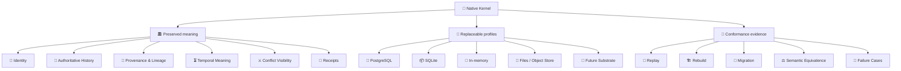
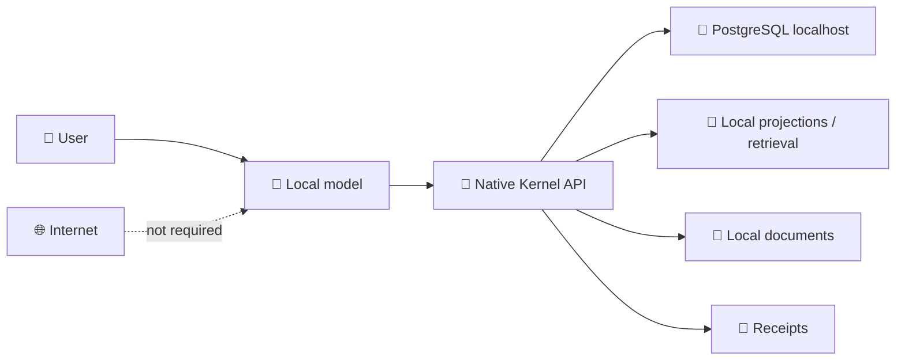
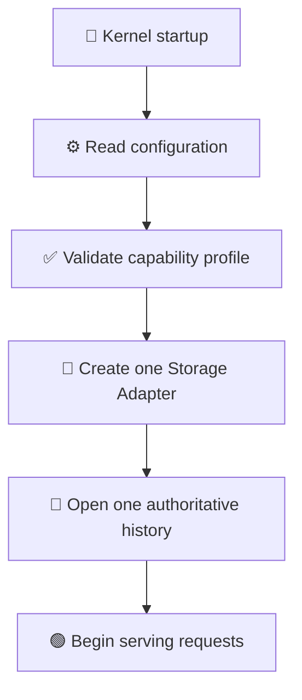
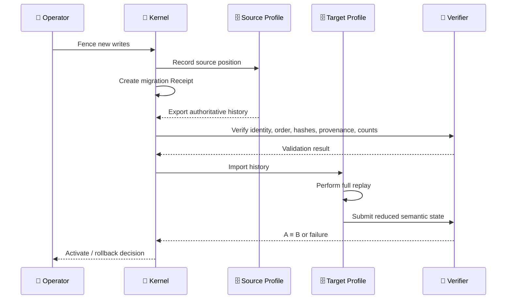

# 🐘📦 Storage and Execution Profiles

**[English](./STORAGE_AND_EXECUTION_PROFILES.md) · [Русский](./STORAGE_AND_EXECUTION_PROFILES.ru.md)**

| 🧭 Dimension | 📌 State |
|---|---|
| **Decision status** | `ACCEPTED` |
| **Evidence level** | `DOCUMENTED` |
| **Implementation status** | `NOT_STARTED` |
| **Operator approval** | `APPROVED` |
| **Architecture layer** | present-day Implementation Profile direction, not Architecture Canon |

> [!IMPORTANT]
> **PostgreSQL and SQLite are replaceable present-day implementation profiles.** Neither database defines the meaning of a Claim, Event, Relation, Epistemic State, Conflict, Projection, or Receipt.

> *Comment:* *this document does not answer “which database is eternal?” It answers “how can we implement Kernel today without turning a current database into the definition of a future architecture?”*

---

## 👁️ How to read this document

```text
🏛️  Canon            — meaning that must survive technology replacement
📐  Contract         — behaviour every conforming profile must preserve
🔌  Profile          — a concrete present-day contract implementation
🐘  PostgreSQL       — preferred full local / server profile
📦  SQLite           — optional embedded / portable profile
🧪  Evidence         — replay, migration, tests, and equivalence checks
🌌  Future substrate — a future storage form that may not resemble SQL
```

> *Reading hint:* *begin with the compact map and decision tree. Detailed invariants and evidence requirements appear in the second half.*

---

## ⚡ The decision in 30 seconds

```text
                         🧬 NATIVE KERNEL
                                │
                                ▼
                    🏛️ ARCHITECTURE CANON
          identity · history · provenance · time · conflict
                                │
                                ▼
                      📐 STORAGE CONTRACT
       append · read · replay · verify · rebuild · migrate
                                │
              ┌─────────────────┴─────────────────┐
              │                                   │
              ▼                                   ▼
      🐘 PostgreSQL Profile               📦 SQLite Profile
      preferred full profile              optional embedded profile
      local / server / concurrent          single-file / portable
      long-running deployment              test / recovery / device
```

### Compact formula

```text
🐘 PostgreSQL
= preferred full present-day profile
≠ Architecture Canon

📦 SQLite
= useful compact profile
≠ mandatory offline database

🤖 Local LLM + 🐘 Local PostgreSQL
= a fully autonomous system without internet access
```

---

## 🌳 Native Kernel profile tree

```text
🧬 Native Kernel Implementation Profiles
│
├── 🗄️ Storage Profiles
│   ├── 🐘 PostgreSQL
│   │   ├── 💻 local localhost deployment
│   │   ├── 🌐 remote server deployment
│   │   ├── 👥 multiple processes / agents
│   │   ├── 🔐 roles and access separation
│   │   └── 🔄 backup / restore / replication
│   │
│   ├── 📦 SQLite
│   │   ├── 🧩 embedded application
│   │   ├── 💾 one portable file
│   │   ├── 🧪 fixtures and CI
│   │   ├── 🛠️ recovery / diagnostics
│   │   └── 📱 constrained device
│   │
│   ├── 🧪 In-memory
│   │   └── fast deterministic tests
│   │
│   └── 🌌 Future Substrate
│       └── storage that may have no tables or SQL
│
└── 🧠 Compute Profiles
    ├── 🤖 local small model
    ├── 🧠 local large model
    ├── ☁️ remote model
    ├── 🧮 symbolic / deterministic engine
    └── 🌌 future compute substrate
```

> *Comment:* *Storage Profile and Compute Profile are adjacent axes, not a parent-child hierarchy. Model selection must not silently determine database selection.*

---

## 🧠 Mindmap: what remains and what can be replaced



*The central message of the mindmap: technologies may change; semantic obligations and verification rules must not disappear with them.*

---

## 📴 Offline does not mean SQLite

A fully autonomous computer can run every component locally:

```text
💻 One local computer — internet not required
│
├── 🤖 small or large local LLM
├── 🧬 Native Kernel implementation
├── 🐘 PostgreSQL on localhost
├── 🔎 local indexes and projections
├── 📁 local documents
└── 🧾 local Receipts and verification logs
```



PostgreSQL can run as a local server process. A local model communicates with the Kernel service, and Kernel uses PostgreSQL through `localhost` without cloud infrastructure.

```text
❌ offline = SQLite
❌ online  = PostgreSQL

✅ full local / server profile = PostgreSQL
✅ compact embedded profile    = SQLite
```

> *Comment:* *“server process” does not mean “remote cloud.” The PostgreSQL server may run on the same computer as Kernel and the local model.*

---

## 🧭 Decision tree: PostgreSQL or SQLite?

```text
Begin profile selection
        │
        ├── Do you need concurrent writers, multiple agents,
        │   or a long-running service?
        │          ├── Yes → 🐘 PostgreSQL
        │          └── No
        │
        ├── Do you need roles, network access, backup/restore,
        │   large histories, or complex queries?
        │          ├── Yes → 🐘 PostgreSQL
        │          └── No
        │
        ├── Do you need one portable file without a separate service?
        │          ├── Yes → 📦 SQLite
        │          └── No
        │
        ├── Is this a fixture, CI job, recovery tool, or demo?
        │          ├── Yes → 📦 SQLite or 🧪 In-memory
        │          └── No
        │
        └── Is this an unusual future medium?
                   └── 🌌 New adapter + Conformance Suite
```

> *Practical rule:* *for a full local Titan/Kernel service on an ordinary computer, PostgreSQL is the preferred starting point. For a self-contained component inside an application or a portable utility, SQLite may fit the role more precisely.*

---

## ⚙️ Compute and Storage are independent axes

| 🧠 Compute Profile | 🗄️ Possible Storage Profile | Example |
|---|---|---|
| Local small model | PostgreSQL or SQLite | compact local assistant |
| Local large model | PostgreSQL | full autonomous system |
| Remote model | PostgreSQL or SQLite | client with remote compute |
| Symbolic engine | any conforming profile | formal replay / validation |
| Future compute | future storage or current adapter | experimental substrate |

```text
🧠 Compute Profile                 🗄️ Storage Profile
├── local small model              ├── PostgreSQL
├── local large model              ├── SQLite
├── remote model                   ├── in-memory test store
├── symbolic engine                └── future substrate
└── future compute

              ↘ independent settings ↙
```

A local LLM does not require SQLite. A remote model does not require PostgreSQL. A specific implementation profile may declare constraints, but those constraints must be explicit.

---

## 🔀 Profile Selector instead of per-request database routing

The active authoritative Storage Profile is selected at process, node, or deployment startup:

```yaml
storage:
  profile: postgresql
  connection: postgresql://localhost/native_kernel

compute:
  profile: local_model
```

or:

```yaml
storage:
  profile: sqlite
  path: ./native-kernel.db
```



A normal Router may select compute or retrieval mechanisms, but it must not distribute authoritative writes across databases:

```text
❌ request A → SQLite
❌ request B → PostgreSQL
❌ request C → SQLite again
```

Why this is dangerous:

```text
different authoritative stores
          ↓
different event ordering
          ↓
duplicated or missing Claims
          ↓
ambiguous current state
          ↓
non-reproducible Receipt
```

> *Comment:* *Router answers “how should this task be executed?” Storage authority answers “where is the authoritative history of this instance?” These are different responsibilities.*

---

## 🔄 Switching profiles is substrate migration

Changing the authoritative Storage Profile is not an ordinary Router decision.



### Migration checklist

```text
1️⃣ stop or fence new writes
2️⃣ record source position and migration Receipt
3️⃣ export authoritative history
4️⃣ verify identity, ordering, hashes, provenance, and counts
5️⃣ import history into the target profile
6️⃣ perform full replay
7️⃣ compare semantic state under the declared rule
8️⃣ activate the new profile
9️⃣ preserve rollback evidence
```

```text
one authoritative history
          ├──► 🐘 PostgreSQL reducer ──► semantic state A
          └──► 📦 SQLite reducer     ──► semantic state B

requirement: A ≡ B under the declared conformance rule
```

*Physical byte-for-byte equality is not mandatory. Declared semantic equivalence and observable contractual behaviour are mandatory.*

---

## 🐘 Why PostgreSQL is the preferred full profile

PostgreSQL is preferred when the implementation needs:

- 👥 multiple concurrent readers or writers;
- 🤖 multiple agents, processes, users, or devices;
- 🟢 a continuously running local service;
- 🔐 roles, permissions, and operational isolation;
- 🧾 transactional integrity across related operations;
- 📜 large event histories and complex temporal queries;
- 🧩 JSON, recursive queries, full-text search, and extensions;
- 💾 backup, restore, replication, and mature operational tooling;
- 🌐 a path from localhost to a remote server without changing semantic contracts.

```text
💻 Local workstation
      │
      ├── 🤖 Local LLM
      ├── 🧬 Kernel service
      └── 🐘 PostgreSQL

                 ↓ workload growth

🖥️ Dedicated host / VPS / cluster
      ├── 🧬 Kernel services
      └── 🐘 PostgreSQL profile
```

> *Nuance:* *PostgreSQL is the preferred profile not because it is “closer to truth,” but because its operational envelope better fits a full multi-process system.*

---

## 📦 Why SQLite remains useful

SQLite retains a narrower but complete role:

- 🧩 embedded desktop and mobile applications;
- 💾 compact single-process tools;
- 🧳 portable snapshots and demonstrations;
- 🧪 deterministic fixtures and CI tests;
- 🛠️ recovery and diagnostic utilities;
- 📱 constrained devices;
- 🔌 installations where a separate database service is deliberately undesirable.

```text
📱 / 💻 Embedded application
            │
            ├── application runtime
            ├── Kernel adapter
            └── 📦 native-kernel.db
```

SQLite is not a “degraded architecture.” It is a different operational profile with a smaller concurrency and administration envelope.

> *Nuance:* *SQLite should not be retained only as a symbolic claim of neutrality. It should serve real use cases and pass the same Conformance Suite.*

---

## ⚖️ Profile comparison

| Criterion | 🐘 PostgreSQL | 📦 SQLite |
|---|---|---|
| Primary role | full local/server profile | embedded/portable profile |
| Separate process | yes | no |
| One portable file | no | yes |
| Concurrent writers | major strength | constrained envelope |
| Multiple agents/services | preferred | limited scenarios only |
| Roles and permissions | mature | not the primary model |
| Network access | native | requires an external wrapper |
| Backup/restore operations | mature tooling | file-oriented strategies |
| Complex queries and extensions | major strength | compact feature set |
| Embedded distribution | more complex | major strength |
| Architecture Canon | ❌ no | ❌ no |
| Offline | ✅ yes | ✅ yes |

---

## 🧩 Storage Adapter boundary

Kernel semantics must depend on an abstract contract, not on SQL dialect details:

```text
📐 StorageContract
│
├── append_event(...)
├── read_authoritative_history(...)
├── verify_integrity(...)
├── load_projection_source(...)
├── rebuild_from_history(...)
├── record_migration_receipt(...)
└── expose_declared_capabilities(...)
```

```text
                 📐 StorageContract
                         │
        ┌────────────────┼─────────────────┐
        ▼                ▼                 ▼
🐘 PostgreSQL       📦 SQLite        🧪 InMemory
StorageAdapter      StorageAdapter    TestAdapter
        │                │                 │
        └────────────────┼─────────────────┘
                         ▼
               🌌 FutureSubstrateAdapter
```

Backend-generated row IDs, tables, foreign keys, indexes, WAL settings, extensions, and transaction syntax remain profile details unless a separate cross-profile contract explicitly raises a behaviour above the adapter boundary.

---

## 🚨 Antipatterns

```text
❌ Claim identity = PostgreSQL SERIAL
❌ Event meaning  = SQL INSERT
❌ Relation       = only a foreign key
❌ Truth          = latest value in a row
❌ Offline        = necessarily SQLite
❌ Router         = writes randomly to different authoritative stores
❌ Replica/cache  = source of truth
❌ One backend    = proven storage neutrality
```

Correct form:

```text
✅ Claim identity survives backend-generated ID replacement
✅ Event meaning survives a specific SQL command
✅ Relation has an independent semantic contract
✅ Current state is derived from authoritative history
✅ Storage profile is selected explicitly
✅ Migration includes Receipt and replay
✅ Neutrality is supported by cross-profile evidence
```

---

## 🔒 Invariants

1. 🏛️ PostgreSQL is the preferred current full profile, but it is not permanent Canon.
2. 📦 SQLite is optional and is not equivalent to offline mode.
3. 📜 One Kernel instance has one declared authoritative history unless a distributed-history protocol is separately specified.
4. 🧠 Compute routing must not silently change storage authority.
5. 🔀 A Router may choose compute/retrieval, but not alternate authoritative stores without a protocol.
6. 🔄 Migration requires a Receipt, validation, replay, and a declared rollback path.
7. ⚖️ PostgreSQL and SQLite profiles must preserve the same declared semantic contracts.
8. 🗂️ Cache, replica, snapshot, and Projection are not authoritative history.
9. 📴 A local model may operate fully autonomously with local PostgreSQL.
10. 🌌 Future substrates enter through conformance, not through resemblance to SQL.

---

## 🧪 Evidence required before implementation claims

Public `main` does not yet contain a runtime implementing this decision. A future profile must provide:

```text
📐 Contract evidence
├── committed StorageContract
├── capability declaration
└── documented failure semantics

📜 History evidence
├── canonical event fixture
├── expected reduced semantic state
└── deterministic replay

🐘 PostgreSQL evidence
├── append / replay / rebuild tests
├── concurrency and interruption cases
└── backup / restore validation

📦 SQLite evidence
├── append / replay / rebuild tests
├── locking and interruption cases
└── portable-file validation

⚖️ Cross-profile evidence
├── semantic-equivalence tests
├── migration tests
├── rollback tests
└── Receipts for migration and recovery
```

> [!NOTE]
> One working PostgreSQL implementation proves the PostgreSQL profile. It does **not prove storage neutrality**. Neutrality requires another substantially different conforming profile or equivalent cross-substrate evidence.

---

## 🚫 What this decision does not do

This document does not:

- require PostgreSQL in every implementation;
- require SQLite in every product;
- define a production schema;
- turn a PostgreSQL extension into Canon;
- define distributed consensus or offline multi-writer synchronization;
- claim that runtime code already exists in `main`;
- require Titan, Crystal, Mentaury, or another project to follow this selection.

*This is an implementation direction for Native Kernel, not a universal mandate for the entire Velantrim ecosystem.*

---

## 🧾 Final memory aid

```text
🏛️ Canon defines meaning
📐 Contract defines required behaviour
🔌 Adapter binds a contract to technology
🐘 PostgreSQL serves the full present-day profile
📦 SQLite serves the compact embedded profile
🔀 Selector chooses authority at startup
🔄 Migration changes profile under control
🧪 Conformance demonstrates preserved meaning
🌌 Future substrate remains possible
```

> *Final comment:* *a good future architecture does not have to avoid strong present-day technologies. It has to use them in a way that allows their eventual replacement without losing meaning.*

---

## 📚 Related documents

- [`FOUNDATIONAL_INTENT.md`](./FOUNDATIONAL_INTENT.md)
- [`LONG_HORIZON_VISION.md`](./LONG_HORIZON_VISION.md)
- [`CONFORMANCE_MODEL.md`](./CONFORMANCE_MODEL.md)
- [`INTEGRATION_BOUNDARIES.md`](./INTEGRATION_BOUNDARIES.md)
- [`adr/0001-architecture-canon-vs-implementation-profiles.md`](./adr/0001-architecture-canon-vs-implementation-profiles.md)
- [`adr/0009-postgresql-primary-sqlite-optional-profile.md`](./adr/0009-postgresql-primary-sqlite-optional-profile.md)
