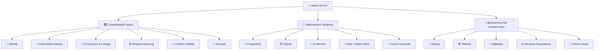
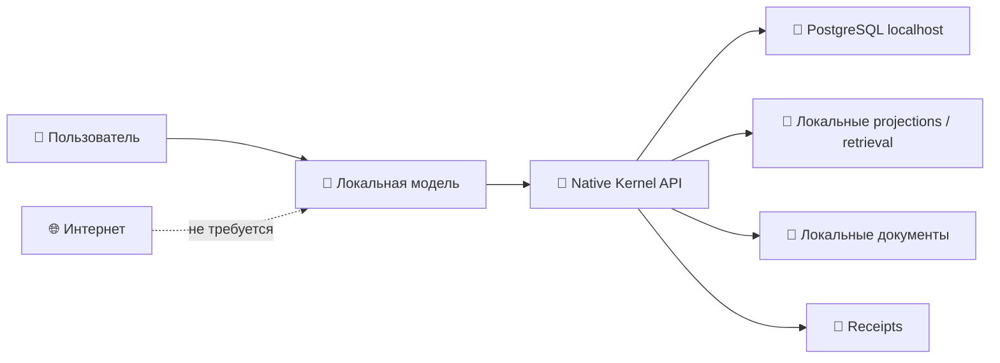
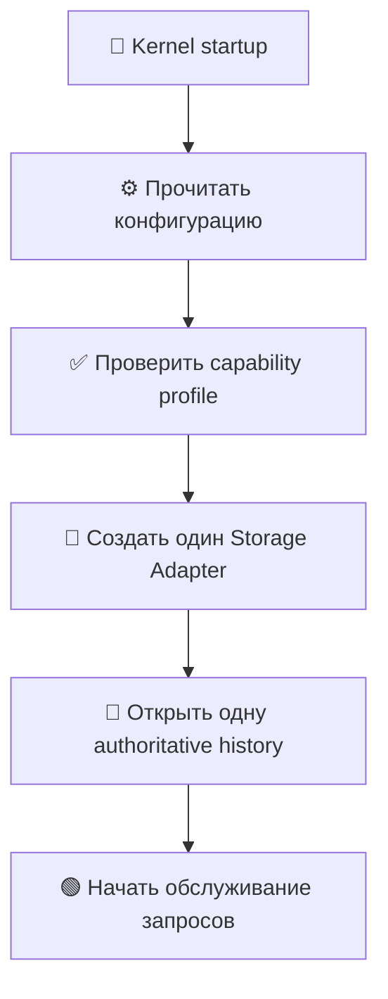
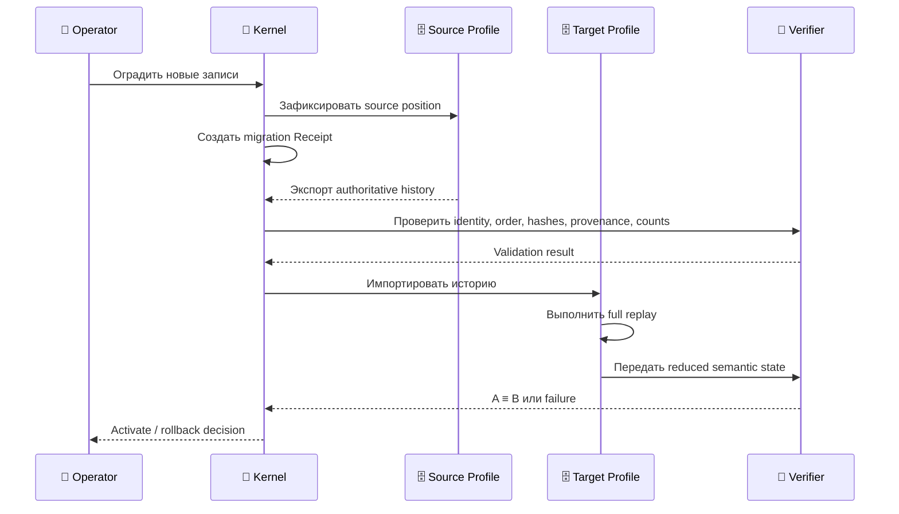

# 🐘📦 Профили хранения и вычисления

**[English](./STORAGE_AND_EXECUTION_PROFILES.md) · [Русский](./STORAGE_AND_EXECUTION_PROFILES.ru.md)**

| 🧭 Измерение | 📌 Состояние |
|---|---|
| **Статус решения** | `ACCEPTED` |
| **Уровень доказательств** | `DOCUMENTED` |
| **Статус реализации** | `NOT_STARTED` |
| **Одобрение оператора** | `APPROVED` |
| **Архитектурный уровень** | современный Implementation Profile, не Architecture Canon |

> [!IMPORTANT]
> **PostgreSQL и SQLite являются заменяемыми современными профилями реализации.** Ни одна из этих баз данных не определяет смысл Claim, Event, Relation, Epistemic State, Conflict, Projection или Receipt.

> *Комментарий:* *этот документ отвечает не на вопрос «какая база данных вечная?», а на вопрос «как сегодня реализовать Kernel, не превратив современную базу в определение архитектуры будущего».*

---

## 👁️ Как читать этот документ

```text
🏛️  Canon            — смысл, который должен пережить замену технологии
📐  Contract         — поведение, которое обязан сохранить профиль
🔌  Profile          — конкретная современная реализация контракта
🐘  PostgreSQL       — основной полный локальный / серверный профиль
📦  SQLite           — опциональный embedded / portable профиль
🧪  Evidence         — тесты, replay, migration и проверка эквивалентности
🌌  Future substrate — будущий способ хранения, возможно вообще не SQL
```

> *Подсказка:* *сначала посмотрите краткую карту и дерево выбора. Детальные инварианты и доказательства находятся во второй половине документа.*

---

## ⚡ Решение за 30 секунд

```text
                         🧬 NATIVE KERNEL
                                │
                                ▼
                    🏛️ ARCHITECTURE CANON
          identity · history · provenance · time · conflict
                                │
                                ▼
                      📐 STORAGE CONTRACT
       append · read · replay · verify · rebuild · migrate
                                │
              ┌─────────────────┴─────────────────┐
              │                                   │
              ▼                                   ▼
      🐘 PostgreSQL Profile               📦 SQLite Profile
      основной полный профиль             опциональный embedded
      local / server / concurrent          single-file / portable
      long-running deployment              test / recovery / device
```

### Короткая формула

```text
🐘 PostgreSQL
= предпочтительный полный профиль настоящего
≠ Architecture Canon

📦 SQLite
= полезный компактный профиль
≠ обязательная offline-база

🤖 Local LLM + 🐘 Local PostgreSQL
= полностью автономная система без интернета
```

---

## 🌳 Дерево профилей Native Kernel

```text
🧬 Native Kernel Implementation Profiles
│
├── 🗄️ Storage Profiles
│   ├── 🐘 PostgreSQL
│   │   ├── 💻 локальный localhost
│   │   ├── 🌐 удалённый сервер
│   │   ├── 👥 несколько процессов / агентов
│   │   ├── 🔐 роли и разграничение доступа
│   │   └── 🔄 backup / restore / replication
│   │
│   ├── 📦 SQLite
│   │   ├── 🧩 embedded-приложение
│   │   ├── 💾 один переносимый файл
│   │   ├── 🧪 fixtures и CI
│   │   ├── 🛠️ recovery / diagnostics
│   │   └── 📱 constrained device
│   │
│   ├── 🧪 In-memory
│   │   └── быстрые детерминированные тесты
│   │
│   └── 🌌 Future Substrate
│       └── носитель, который может не иметь таблиц и SQL
│
└── 🧠 Compute Profiles
    ├── 🤖 local small model
    ├── 🧠 local large model
    ├── ☁️ remote model
    ├── 🧮 symbolic / deterministic engine
    └── 🌌 future compute substrate
```

> *Комментарий:* *Storage Profile и Compute Profile расположены рядом, но не вложены друг в друга. Выбор модели не должен молча определять выбор базы данных.*

---

## 🧠 Mindmap: что остаётся, а что заменяется



*Главная идея mindmap: технологии могут меняться; смысловые обязательства и правила проверки не должны исчезать вместе с ними.*

---

## 📴 Offline не означает SQLite

Полностью автономный компьютер может локально запускать все компоненты:

```text
💻 Один локальный компьютер — интернет не требуется
│
├── 🤖 небольшая или крупная локальная LLM
├── 🧬 реализация Native Kernel
├── 🐘 PostgreSQL на localhost
├── 🔎 локальные индексы и проекции
├── 📁 локальные документы
└── 🧾 локальные Receipts и журналы проверки
```



PostgreSQL может работать как локальный server process. Локальная модель взаимодействует с Kernel-сервисом, а Kernel использует PostgreSQL через `localhost` без облачной инфраструктуры.

```text
❌ offline = SQLite
❌ online  = PostgreSQL

✅ полноценный локальный / серверный профиль = PostgreSQL
✅ компактный embedded-профиль               = SQLite
```

> *Комментарий:* *«server process» не означает «удалённое облако». Сервер PostgreSQL может находиться на том же компьютере, что и Kernel и локальная модель.*

---

## 🧭 Дерево выбора: PostgreSQL или SQLite?

```text
Начинаем выбор профиля
        │
        ├── Нужны параллельные writers, несколько агентов
        │   или долгоживущий сервис?
        │          ├── Да  → 🐘 PostgreSQL
        │          └── Нет
        │
        ├── Нужны роли, сетевой доступ, backup/restore,
        │   большие журналы или сложные запросы?
        │          ├── Да  → 🐘 PostgreSQL
        │          └── Нет
        │
        ├── Нужен один переносимый файл без отдельного сервиса?
        │          ├── Да  → 📦 SQLite
        │          └── Нет
        │
        ├── Это fixture, CI, recovery tool или demo?
        │          ├── Да  → 📦 SQLite или 🧪 In-memory
        │          └── Нет
        │
        └── Необычный будущий носитель?
                   └── 🌌 Новый adapter + Conformance Suite
```

> *Практическое правило:* *если создаётся полноценный локальный Titan/Kernel-сервис на обычном компьютере, PostgreSQL является предпочтительным стартом. Если создаётся автономный компонент внутри приложения или переносимая утилита — SQLite может быть точнее по роли.*

---

## ⚙️ Compute и Storage — две независимые оси

| 🧠 Compute Profile | 🗄️ Возможный Storage Profile | Пример |
|---|---|---|
| Local small model | PostgreSQL или SQLite | компактный локальный ассистент |
| Local large model | PostgreSQL | полноценная автономная система |
| Remote model | PostgreSQL или SQLite | клиент с удалённым compute |
| Symbolic engine | любой conforming profile | формальный replay / validation |
| Future compute | future storage или современный adapter | экспериментальный субстрат |

```text
🧠 Compute Profile                 🗄️ Storage Profile
├── local small model              ├── PostgreSQL
├── local large model              ├── SQLite
├── remote model                   ├── in-memory test store
├── symbolic engine                └── future substrate
└── future compute

              ↘ независимые настройки ↙
```

Локальная LLM не требует SQLite. Удалённая модель не требует PostgreSQL. Конкретный implementation profile может устанавливать ограничения, но они должны быть объявлены явно.

---

## 🔀 Profile Selector вместо database routing на каждый запрос

Активный авторитетный Storage Profile выбирается при запуске процесса, узла или deployment:

```yaml
storage:
  profile: postgresql
  connection: postgresql://localhost/native_kernel

compute:
  profile: local_model
```

или:

```yaml
storage:
  profile: sqlite
  path: ./native-kernel.db
```



Обычный Router может выбирать compute- или retrieval-механизм, но не должен распределять авторитетные записи между базами:

```text
❌ запрос A → SQLite
❌ запрос B → PostgreSQL
❌ запрос C → снова SQLite
```

Почему это опасно:

```text
разные authoritative stores
          ↓
разный порядок событий
          ↓
дублирование или потеря Claims
          ↓
неоднозначный current state
          ↓
невоспроизводимый Receipt
```

> *Комментарий:* *Router отвечает на вопрос «как выполнить задачу?». Storage authority отвечает на вопрос «где находится авторитетная история этого экземпляра?». Это разные обязанности.*

---

## 🔄 Переключение профиля — это миграция субстрата

Замена авторитетного профиля хранения не является обычным решением Router.



### Контрольный список миграции

```text
1️⃣ остановить или оградить новые записи
2️⃣ зафиксировать source position и migration Receipt
3️⃣ экспортировать authoritative history
4️⃣ проверить identity, ordering, hashes, provenance и counts
5️⃣ импортировать историю в target profile
6️⃣ выполнить полный replay
7️⃣ сравнить semantic state по объявленному правилу
8️⃣ активировать новый профиль
9️⃣ сохранить rollback evidence
```

```text
одна authoritative history
          ├──► 🐘 PostgreSQL reducer ──► semantic state A
          └──► 📦 SQLite reducer     ──► semantic state B

требование: A ≡ B по объявленному conformance rule
```

*Побитовое совпадение физического хранения не обязательно. Обязательна заявленная семантическая эквивалентность и наблюдаемое контрактное поведение.*

---

## 🐘 Почему PostgreSQL — основной полный профиль

PostgreSQL предпочтителен, когда нужны:

- 👥 несколько параллельных readers или writers;
- 🤖 несколько агентов, процессов, пользователей или устройств;
- 🟢 постоянно работающий локальный сервис;
- 🔐 роли, права и операционная изоляция;
- 🧾 транзакционная целостность связанных операций;
- 📜 крупная история событий и сложные temporal queries;
- 🧩 JSON, recursive queries, full-text search и расширения;
- 💾 backup, restore, replication и зрелые operational tools;
- 🌐 переход от localhost к удалённому серверу без изменения смыслового контракта.

```text
💻 Local workstation
      │
      ├── 🤖 Local LLM
      ├── 🧬 Kernel service
      └── 🐘 PostgreSQL

                 ↓ рост нагрузки

🖥️ Dedicated host / VPS / cluster
      ├── 🧬 Kernel services
      └── 🐘 PostgreSQL profile
```

> *Нюанс:* *PostgreSQL является основным профилем не потому, что он «ближе к истине», а потому, что его operational envelope лучше соответствует полной многопроцессной системе.*

---

## 📦 Почему SQLite остаётся полезным

SQLite сохраняет более узкую, но полноценную роль:

- 🧩 embedded desktop- и mobile-приложения;
- 💾 компактные single-process инструменты;
- 🧳 переносимые snapshots и демонстрации;
- 🧪 детерминированные fixtures и CI-тесты;
- 🛠️ recovery- и diagnostic-утилиты;
- 📱 ограниченные устройства;
- 🔌 установки, где отдельный database service сознательно нежелателен.

```text
📱 / 💻 Embedded application
            │
            ├── application runtime
            ├── Kernel adapter
            └── 📦 native-kernel.db
```

SQLite — не «ухудшенная архитектура». Это другой операционный профиль с меньшим envelope конкурентности и администрирования.

> *Нюанс:* *не следует сохранять SQLite только ради символического доказательства нейтральности. Он должен иметь реальные use cases и проходить ту же Conformance Suite.*

---

## ⚖️ Сравнение профилей

| Критерий | 🐘 PostgreSQL | 📦 SQLite |
|---|---|---|
| Основная роль | полный local/server profile | embedded/portable profile |
| Отдельный процесс | да | нет |
| Один переносимый файл | нет | да |
| Параллельные writers | сильная сторона | ограниченный envelope |
| Несколько агентов/сервисов | предпочтительно | только в ограниченных сценариях |
| Роли и permissions | развитые | не основная модель |
| Network access | нативно | требует внешней оболочки |
| Backup/restore operations | зрелые средства | файловые стратегии |
| Сложные запросы и расширения | сильная сторона | компактный набор |
| Embedded distribution | сложнее | сильная сторона |
| Architecture Canon | ❌ нет | ❌ нет |
| Offline | ✅ да | ✅ да |

---

## 🧩 Граница Storage Adapter

Kernel-семантика должна зависеть от абстрактного контракта, а не от SQL-диалекта:

```text
📐 StorageContract
│
├── append_event(...)
├── read_authoritative_history(...)
├── verify_integrity(...)
├── load_projection_source(...)
├── rebuild_from_history(...)
├── record_migration_receipt(...)
└── expose_declared_capabilities(...)
```

```text
                 📐 StorageContract
                         │
        ┌────────────────┼─────────────────┐
        ▼                ▼                 ▼
🐘 PostgreSQL       📦 SQLite        🧪 InMemory
StorageAdapter      StorageAdapter    TestAdapter
        │                │                 │
        └────────────────┼─────────────────┘
                         ▼
               🌌 FutureSubstrateAdapter
```

Backend-generated row IDs, tables, foreign keys, indexes, WAL settings, extensions и transaction syntax остаются деталями профиля, пока отдельный cross-profile contract явно не поднимет поведение выше границы адаптера.

---

## 🚨 Антипаттерны

```text
❌ Claim identity = PostgreSQL SERIAL
❌ Event meaning  = SQL INSERT
❌ Relation       = только foreign key
❌ Truth          = последнее значение в row
❌ Offline        = обязательно SQLite
❌ Router         = случайно пишет в разные authoritative stores
❌ Replica/cache  = источник истины
❌ One backend    = доказанная storage neutrality
```

Правильная форма:

```text
✅ Claim identity переживает замену backend-generated ID
✅ Event сохраняет значение вне конкретной SQL-команды
✅ Relation имеет самостоятельный смысловой контракт
✅ Current state выводится из authoritative history
✅ Storage profile выбирается явно
✅ Migration сопровождается Receipt и replay
✅ Neutrality доказывается cross-profile evidence
```

---

## 🔒 Инварианты

1. 🏛️ PostgreSQL предпочтителен как текущий полный профиль, но не является постоянным Canon.
2. 📦 SQLite опционален и не равен offline-режиму.
3. 📜 Один экземпляр Kernel имеет одну объявленную authoritative history, если отдельно не определён distributed-history protocol.
4. 🧠 Compute routing не должен незаметно менять storage authority.
5. 🔀 Router может выбирать compute/retrieval, но не чередовать authoritative stores без протокола.
6. 🔄 Миграция должна иметь Receipt, validation, replay и заявленный rollback path.
7. ⚖️ PostgreSQL- и SQLite-профили должны сохранять одинаковые объявленные semantic contracts.
8. 🗂️ Cache, replica, snapshot и Projection не являются authoritative history.
9. 📴 Локальная модель может полностью автономно работать с локальным PostgreSQL.
10. 🌌 Будущие субстраты допускаются через conformance, а не через сходство с SQL.

---

## 🧪 Какие доказательства нужны до заявления о реализации

В публичном `main` пока нет runtime, реализующего это решение. Будущий профиль должен предоставить:

```text
📐 Contract evidence
├── committed StorageContract
├── capability declaration
└── documented failure semantics

📜 History evidence
├── canonical event fixture
├── expected reduced semantic state
└── deterministic replay

🐘 PostgreSQL evidence
├── append / replay / rebuild tests
├── concurrency and interruption cases
└── backup / restore validation

📦 SQLite evidence
├── append / replay / rebuild tests
├── locking and interruption cases
└── portable-file validation

⚖️ Cross-profile evidence
├── semantic-equivalence tests
├── migration tests
├── rollback tests
└── Receipts for migration and recovery
```

> [!NOTE]
> Одна работающая PostgreSQL-реализация доказывает PostgreSQL-профиль. Она **не доказывает storage neutrality**. Для нейтральности нужен второй существенно отличный conforming profile или эквивалентные cross-substrate доказательства.

---

## 🚫 Что это решение не делает

Документ не:

- требует PostgreSQL в каждой реализации;
- требует SQLite в каждом продукте;
- определяет production schema;
- превращает PostgreSQL extension в Canon;
- задаёт distributed consensus или offline multi-writer synchronization;
- заявляет, что runtime уже существует в `main`;
- обязывает Titan, Crystal, Mentaury или другой проект следовать этому выбору.

*Это направление реализации Native Kernel, а не универсальный приказ всей экосистеме Velantrim.*

---

## 🧾 Итоговая памятка

```text
🏛️ Canon задаёт смысл
📐 Contract задаёт обязательное поведение
🔌 Adapter связывает контракт с технологией
🐘 PostgreSQL обслуживает полный современный профиль
📦 SQLite обслуживает компактный embedded-профиль
🔀 Selector выбирает authority при запуске
🔄 Migration меняет профиль контролируемо
🧪 Conformance доказывает, что смысл сохранился
🌌 Future substrate остаётся возможным
```

> *Финальный комментарий:* *хорошая архитектура будущего не обязана избегать сильных технологий настоящего. Она обязана использовать их так, чтобы иметь возможность однажды заменить их без потери смысла.*

---

## 📚 Связанные документы

- [`FOUNDATIONAL_INTENT.ru.md`](./FOUNDATIONAL_INTENT.ru.md)
- [`LONG_HORIZON_VISION.md`](./LONG_HORIZON_VISION.md)
- [`CONFORMANCE_MODEL.md`](./CONFORMANCE_MODEL.md)
- [`INTEGRATION_BOUNDARIES.md`](./INTEGRATION_BOUNDARIES.md)
- [`adr/0001-architecture-canon-vs-implementation-profiles.md`](./adr/0001-architecture-canon-vs-implementation-profiles.md)
- [`adr/0009-postgresql-primary-sqlite-optional-profile.md`](./adr/0009-postgresql-primary-sqlite-optional-profile.md)
